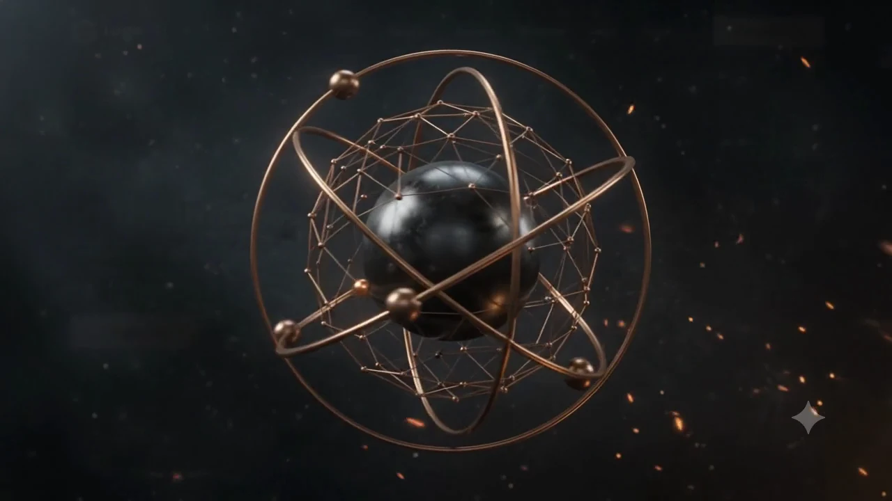

# The Blacksmith Market

## Blender-Led 3D Web Experience Revamp — Product Requirements and Implementation Specification

**Prepared:** 2026-07-25  
**Repository:** `C:\idrive -carlo\Cloud-Drive_carloboul57@gmail.com\Cloud-Drive\Full\TBM\my-live-website`  
**Current branch:** `codex/final-forge-hero-recovery-v3`  
**Current HEAD:** `65cdf3c34ad6fc87837bee9969b1d382cf3bb762`  
**Document status:** implementation-ready PRD; no production patch is applied by this document  
**Deployment status:** no deployment, commit, push, PR, DNS or Sites change is authorised by this document  

---

## 1. Executive decision

The approved direction is a genuine homepage experience revamp, not another calibration pass on the existing V4 procedural armillary.

The implementation will:

1. Preserve the static HTML/CSS/JavaScript site and GitHub Pages compatibility.
2. Use Blender 5.2 LTS to author one master armillary sculpture, its cinematic assembly animation, the reveal camera, studio lighting, materials, smoke and sparks.
3. Render the opening reveal as an optimised scroll-controlled WebP frame sequence.
4. Export the same master sculpture as an optimised GLB for the live Three.js homepage hero.
5. Use one GSAP ScrollTrigger timeline as the sole scroll owner from reveal start through the homepage handoff.
6. Remove the four floating hero cards that currently compete with the sculpture.
7. Redesign Product Focus as an interactive connected-category composition.
8. Redesign How We Buy as one connected four-stage supplier journey.
9. Add a Commercial Insights section using semantic HTML, CSS and animated SVG—not a second large WebGL scene.
10. Retain the approved business wording unless an exact wording change is separately approved.
11. Preserve reduced-motion, WebGL fallback, no-JavaScript access and reverse-scroll behaviour.

### Required runtime stack

- Static HTML/CSS/JavaScript.
- Three.js `0.180.0` initially, upgraded only in a separate reviewed dependency patch.
- `GLTFLoader` and `MeshoptDecoder` from the same Three.js distribution.
- GSAP `3.13.0` and ScrollTrigger `3.13.0`.
- Blender-rendered WebP frames.
- One optimised GLB.
- SVG/CSS/GSAP for section-level network animations.

### Required development stack

- Blender `5.2.0 LTS` — already installed and command-line verified.
- Blender Python API (`bpy`) — bundled with Blender and verified.
- Blender glTF exporter — bundled and verified.
- FFmpeg/ffprobe — already available.
- Python + Pillow — already used by the repository.
- Playwright — browser flow, screenshot and scroll-path testing.
- `@axe-core/playwright` — automated accessibility checks.
- Lighthouse/Lighthouse CI — repeatable performance budgets.
- glTF-Transform CLI — GLB inspection and optimisation.

### Rejected for this implementation

- React or React Three Fiber.
- Drei.
- Spline runtime.
- Lenis or another smooth-scroll owner.
- Theatre.js as a runtime dependency.
- A second large 3D sculpture elsewhere on the homepage.
- A Blender MCP as a requirement.
- Crossfading between two geometrically different objects.
- Retaining the current floating hero cards.
- Claiming that the Insights section contains live market data unless a real data source is supplied and approved.

---

## 2. Supersession and source of truth

The following older constraints are superseded:

- “no full-site redesign”;
- “no new homepage sections”;
- “no Blender/GLTF”;
- “restore V2/V4 as the final visual direction”;
- “preserve the floating cards”;
- “matching the silhouette bounding box is sufficient”.

Those constraints belonged to corrective-recovery passes. They do not represent the present approved revamp.

When sources conflict, use this order:

1. This PRD and later explicit user approvals.
2. Current code and live runtime evidence.
3. Generated visual references listed in section 3.
4. Blender master scene and exported camera/material contracts.
5. The supplied generated video as evidence of what was too bland.
6. Earlier plans and handoffs, marked superseded where they disagree.

The current production code remains authoritative for existing wording, URLs and business behaviour until a planned milestone explicitly changes it.

---

## 3. Visual references and interpretation

### 3.1 Reveal phase references

#### Phase A — Core ignition

`C:\Users\chris\.codex\generated_images\019f95b6-e5c4-7c81-a8d6-bfe97f1e0506\exec-aeb22dd6-d6dc-45f8-ae81-d9e3c11d1560.png`

Implementation meaning:

- black lacquer core emerges first;
- three bronze ring segments remain visibly separated;
- sparks bridge ring segments and core;
- the complete armillary must not already exist at frame one.

#### Phase B — Orbital lock and network construction

`C:\Users\chris\.codex\generated_images\019f95b6-e5c4-7c81-a8d6-bfe97f1e0506\exec-9606a165-543f-4640-b725-b7d968fe4478.png`

Implementation meaning:

- ring motion is visibly incomplete;
- one ring arrives from depth with controlled overshoot;
- cage curves draw progressively;
- nodes travel along paths before locking to their junctions.

#### Phase C — Forge impact and handoff threshold

`C:\Users\chris\.codex\generated_images\019f95b6-e5c4-7c81-a8d6-bfe97f1e0506\exec-756b48b1-79df-4d5b-9107-def112c46742.png`

Implementation meaning:

- the sculpture is complete;
- one restrained circular light pulse travels through the cage;
- sparks briefly intensify;
- the camera finishes its arc;
- the object begins moving toward the right-hand hero stage;
- left-side negative space opens before the homepage copy appears.

### 3.2 Settled homepage reference

`C:\Users\chris\.codex\generated_images\019f95b6-e5c4-7c81-a8d6-bfe97f1e0506\call_BdRByN33NSWaMSfeKwsFPlac.png`

Implementation meaning:

- two-column hero;
- copy remains on the left;
- live GLB remains on the right;
- no floating cards around the sculpture;
- subtle pointer cue and Pause Ambient Motion control;
- faint network continuation may extend beyond the hero stage without obscuring text.

### 3.3 Product Focus reference

`C:\Users\chris\.codex\generated_images\019f95b6-e5c4-7c81-a8d6-bfe97f1e0506\call_qzlg1BztSIynre1EpALCTOyt.png`

Implementation meaning:

- connected category composition;
- current categories and approved destination URLs remain authoritative;
- one selected category expands;
- visual connections are SVG/CSS, not another WebGL canvas;
- selection must work with pointer, keyboard and touch.

The mockup’s example category labels are not automatically approved business taxonomy. Use the current site categories unless Christian approves replacements.

### 3.4 How We Buy reference

`C:\Users\chris\.codex\generated_images\019f95b6-e5c4-7c81-a8d6-bfe97f1e0506\call_346lGCpvTcRjdhbwx2xbcbHn.png`

Implementation meaning:

- one connected four-stage path;
- active stage exposes detail without hiding essential information;
- scroll may highlight stages sequentially;
- all stages remain readable without JavaScript;
- existing process wording is preserved unless separately approved.

### 3.5 Commercial Insights reference

`C:\Users\chris\.codex\generated_images\019f95b6-e5c4-7c81-a8d6-bfe97f1e0506\exec-4f609b8b-2016-4c2c-879e-35fa05769936.png`

Implementation meaning:

- a new editorial section with a network map;
- filters and selected-node details;
- SVG paths, CSS and GSAP;
- no second large 3D scene;
- no invented “live” demand, margin or seven-day trend claims.

Until a real data source is approved, labels must describe TBM’s evaluation lens, for example:

- demand signal considered;
- margin fit reviewed;
- documentation route;
- operational fit;
- category focus.

### 3.6 Mobile reference

`C:\Users\chris\.codex\generated_images\019f95b6-e5c4-7c81-a8d6-bfe97f1e0506\call_WigjorDUMvLUBLZUqaKQ3mAW.png`

Implementation meaning:

- the sculpture is visible before the copy;
- simplified live GLB or high-quality static fallback;
- large touch targets;
- no floating cards;
- no cropped armillary;
- Pause Motion remains accessible.

### 3.7 Rejected motion evidence

`C:\Users\chris\Downloads\Create_a_realistic_second_.mp4`

Verified:

- 1280×720;
- H.264;
- 24 fps;
- 240 frames;
- 10 seconds.

Why it is rejected as the final reveal:

- the complete armillary exists from the beginning;
- most of the video is rotation and shrinking;
- ring arrival, cage construction, node travel and an impact event are missing;
- environmental and lighting progression is weak;
- action does not form a readable sequence of events.

---

## 4. Product goals

### 4.1 Primary goals

1. The opening experience must immediately feel newly designed.
2. The reveal must contain distinct action beats rather than one continuous rotate-and-shrink movement.
3. The final reveal frame and live hero must use the same master geometry, camera contract and pose.
4. The homepage must communicate TBM’s supplier proposition without the sculpture or effects obscuring it.
5. The rest of the homepage must carry the network/forge visual language without repeating large 3D objects.
6. Every motion path must be deterministic forward and backward.
7. The experience must remain usable when animation, reveal assets or WebGL fail.

### 4.2 Business goals

- Make the supplier route feel structured and credible.
- Distinguish TBM visually from generic wholesale templates.
- Direct users toward Sell to Us, Product Focus and Submit Your Range.
- Preserve the website’s actual business claims.
- Avoid decorative data visualisation that implies unsupported live intelligence.

### 4.3 Non-goals

- No redesign of secondary pages in this implementation.
- No CMS or database.
- No fabricated market-data integration.
- No audio autoplay.
- No full-screen cursor replacement.
- No scroll hijacking outside the opening sequence.
- No deployment within an implementation pass until local review is approved.

---

## 5. Target experience storyboard

### 5.1 Timeline contract

Blender authoring timeline:

- 24 fps;
- 156 master frames;
- 6.5 seconds equivalent;
- rendered losslessly before web encoding;
- sampled to a 64-frame production sequence after visual approval.

Web scroll contract:

- reveal scroll range: approximately `2.8 × viewport height`;
- progress `0.00–1.00`;
- one pinned owner;
- no nested pinned hero;
- normal document flow begins only after lifecycle state `released`.

### 5.2 Phase specification

| Phase | Scroll | Blender frames | Visual action | DOM state | WebGL state |
|---|---:|---:|---|---|---|
| Load | n/a | 1 | Core in darkness | semantic homepage present but reveal overlay active | not created |
| Ignition | 0.00–0.17 | 1–26 | core emerges, reflections sweep, ring segments approach | header stable, short reveal label | not created |
| Orbital arrival | 0.17–0.42 | 27–66 | three rings arrive on different axes with restrained overshoot | progress cue only | preload begins near end |
| Network construction | 0.32–0.62 | 50–97 | cage draws, nodes travel and lock | no homepage cards or copy over sculpture | GLB loading/prewarming |
| Forge impact | 0.62–0.74 | 98–116 | single light pulse, brief spark increase, camera response | left grid begins to become possible but remains unreadable | ready, hidden |
| Active orbit | 0.74–0.84 | 117–131 | rings settle into slow movement, camera arc resolves | homepage copy still hidden | handoff pose applied |
| Spatial handoff | 0.84–0.96 | 132–150 | rendered object moves into hero rectangle | hero copy reveals in controlled groups | WebGL crossfade only after pose match |
| Release | 0.96–1.00 | 151–156 | particles clear, object settles | normal homepage becomes interactive | active |
| Hero idle | post-release | GLB | subtle ring motion, pointer damping, reflection movement | normal document flow | active while visible |
| Reverse | reverse scroll | reverse mapping | exact deterministic reversal | copy hides before full-screen return | suspend after swap |

### 5.3 Action rules

- At least four independently readable events must occur before handoff.
- No event may rely only on global object rotation.
- Three rings must have different arrival trajectories and start times.
- Cage construction must use animated curve reveal or geometry growth.
- Nodes must visibly travel before they lock.
- The impact pulse occurs once per forward traversal and reverses cleanly.
- Sparks may intensify for no more than 0.6 seconds equivalent.
- No more than three flashes in any one-second period.
- Pointer movement never changes the scroll timeline.
- Scroll velocity never multiplies ring rotation.

---

## 6. Blender 3D art specification

### 6.1 Verified connection

Executable:

`C:\Program Files\Blender Foundation\Blender 5.2\blender.exe`

Verified capabilities:

- Blender `5.2.0 LTS`;
- background Python execution;
- `.blend` save;
- GLB export;
- Draco available;
- MeshOptimizer available.

No MCP is required. Blender scripts are the reproducible source of truth.

### 6.2 Scene structure

The `.blend` file must use these collections:

```text
TBM_MASTER
├── 00_GUIDES
├── 10_CORE
├── 20_RINGS
├── 30_CAGE
├── 40_NODES
├── 50_PARTICLES
├── 60_LIGHTS
├── 70_CAMERAS
├── 80_REVEAL_ONLY
└── 90_WEB_EXPORT
```

Required named objects:

```text
TBM_Core
TBM_Ring_A
TBM_Ring_B
TBM_Ring_C
TBM_Outer_Frame
TBM_Cage_Curves
TBM_Cage_Mesh
TBM_Node_001 ... TBM_Node_N
TBM_Impact_Pulse
TBM_Sparks
TBM_Smoke
TBM_Camera_Reveal
TBM_Camera_Handoff
TBM_Export_Root
```

### 6.3 Geometry

#### Core

- UV sphere or subdivision sphere.
- Web export target: 8,000–16,000 triangles.
- Perfectly smooth silhouette.
- No baked scratches that read as damaged stock.

#### Rings

- Exactly three dominant rings.
- Curve-based authoring with bevel profiles, then evaluated mesh for export.
- Different major radii and rotations.
- Ring cross-section should be slightly flattened/engineered, not a generic circular torus.
- Target combined web geometry: 12,000–24,000 triangles.

#### Outer frame and cage

- One restrained outer circular/spherical frame.
- Irregular but intentional network.
- Cage must not read as a default icosahedron wireframe.
- Web cage may use curve-derived thin geometry or `Line2` reconstruction from exported vertices if mesh cost is excessive.

#### Nodes

- 12–24 primary nodes.
- Sparse, deliberately placed.
- A small lower-left crossing cluster is acceptable if it supports the reference composition.
- Use shared geometry/material or instancing at runtime.

### 6.4 Material contract

Values are starting targets and must be approved through rendered stills.

| Material | Base colour | Metallic | Roughness | Coat | Notes |
|---|---|---:|---:|---:|---|
| `MAT_Core_Lacquer` | `#050606` | 0.05 | 0.16 | 0.90 | near-black lacquer, broad reflections |
| `MAT_Ring_Bronze` | `#6F3D28` | 0.95 | 0.22 | 0.35 | muted rose-bronze, never emissive orange |
| `MAT_Cage_DarkBronze` | `#3F291F` | 0.86 | 0.32 | 0.10 | subordinate to rings |
| `MAT_Node_Polished` | `#865039` | 1.00 | 0.15 | 0.28 | brighter than cage, sparse |
| `MAT_Pulse` | `#E7B95B` | n/a | n/a | n/a | reveal-only controlled emission |

Material requirements:

- use Principled BSDF-compatible paths for glTF export;
- bake only effects that cannot translate to glTF;
- do not assume Blender procedural nodes will export;
- compare Blender still, GLB viewer and Three.js render side by side.

### 6.5 Lighting

Required reveal lighting:

- one broad cool-white area key producing elongated core reflections;
- one warm bronze rim;
- one low-intensity fill;
- optional overhead strip reflection;
- dark world background;
- volumetric density kept low enough to retain the cage silhouette.

Required web-light contract:

- PMREM environment derived from a lightweight approved environment or generated studio setup;
- one restrained key and rim if required after PMREM;
- no cluster of animated point lights;
- tone mapping and exposure fixed in the camera/material contract.

### 6.6 Camera

The Blender handoff camera must export:

- vertical FOV;
- position;
- quaternion;
- target/aim point;
- sensor fit;
- near/far planes;
- object-root transform;
- handoff frame index.

The Three.js camera must reproduce these values before any artistic runtime motion is added.

### 6.7 Animation

Required Blender actions:

```text
ACT_Core_Ignition
ACT_Ring_Arrival_A
ACT_Ring_Arrival_B
ACT_Ring_Arrival_C
ACT_Cage_Construct
ACT_Node_Travel
ACT_Impact_Pulse
ACT_Camera_Reveal
ACT_Camera_Handoff
ACT_Hero_Idle
```

Only `ACT_Hero_Idle` is expected in the web GLB. Reveal-only effects are rendered into frames.

### 6.8 Blender outputs

```text
blender/tbm-armillary-master.blend
blender/config/tbm-scene-contract.json
blender/scripts/build_tbm_armillary.py
blender/scripts/animate_tbm_reveal.py
blender/scripts/render_tbm_reveal.py
blender/scripts/export_tbm_web.py
assets/3d/tbm-armillary-web.glb
assets/3d/tbm-armillary-fallback.webp
assets/3d/tbm-camera-contract.json
assets/3d/tbm-material-contract.json
artifacts/tbm-v5/blender/stills/
artifacts/tbm-v5/blender/contact-sheets/
```

---

## 7. Homepage section requirements

### 7.1 Opening reveal

- Full viewport beneath the stable site header.
- Canvas frame sequence.
- Short labels only; essential business content remains in the homepage DOM.
- Loading screen is the first approved frame, not a spinner over black.
- Scrubbing starts only when the contiguous production sequence is ready.
- On failure, reveal releases immediately to a complete homepage.

### 7.2 Settled hero

Preserve:

- “We forge value. You grow together.”
- existing lead paragraph;
- Sell to Us;
- Explore Product Focus;
- three supplier process promises.

Change:

- replace procedural V4 mesh with GLB;
- remove all `.float-card` articles;
- move hero visual before copy on narrow screens;
- add a short pointer cue only on pointer-capable desktop devices;
- retain Pause Ambient Motion;
- use one faint SVG/network continuation, never over the headline.

Interactive behaviour:

- pointer changes target yaw/pitch by no more than ±4 degrees;
- damping returns toward neutral;
- pointer has no effect on touch devices;
- idle ring speed remains slow;
- pause state persists in local storage;
- canvas stops rendering when offscreen or tab-hidden.

### 7.3 Product Focus

- Use current approved categories and URLs.
- Present five or six category panels depending on approved taxonomy.
- One selected panel may expand.
- SVG connections illuminate the selected category.
- Selection works by hover, focus, click and tap.
- The selected detail panel may state only approved business facts.
- No fake demand ranking or live market statistics.

### 7.4 How We Buy

- Four current process stages remain in DOM order.
- One connected progress line.
- As the section enters, stages activate sequentially.
- Hover/focus reveals supporting detail without hiding the base stage text.
- On reduced motion, all stages display statically.
- On mobile, use a vertical line with the same semantic order.

### 7.5 Commercial Insights

Purpose:

- explain TBM’s evaluation lens;
- create a distinctive later-page interaction;
- direct users to the existing Insights/blog destination.

Required content:

- approved heading;
- concise description;
- network map of evaluation concepts/categories;
- filter controls;
- selected detail;
- Explore Insights link.

Truthfulness constraint:

- do not call data “live”;
- do not publish demand, margin or trend values without a source;
- do not imply an internal analytics product that does not exist.

### 7.6 Supplier readiness and CTA

- Preserve current supplier requirements and CTA destination.
- Apply the revised connected-line and material language.
- Do not create an embedded submission form unless contact-field requirements and handling are separately approved.

---

## 8. Technical architecture

### 8.1 Experience state machine

```text
boot
  ├── reduced motion ──> static_ready
  ├── reveal failure ──> released_fallback
  └── loading
        └── reveal_ready
              └── scrubbing
                    ├── reverse ──> reveal_ready / loading-safe
                    └── handoff_prewarm
                          └── handoff_ready
                                └── swapping
                                      └── released
                                            └── hero_active
                                                  ├── paused
                                                  ├── offscreen
                                                  └── context_lost ──> hero_fallback
```

### 8.2 Single-scroll-owner rule

During reveal:

- only `js/forge-intro-v5.js` owns reveal progress;
- it may use one ScrollTrigger and one timeline;
- the live hero receives lifecycle events but owns no pin and no scroll range;
- `home-v2.js` must not reveal below-fold sections until normal flow is released.

After release:

- normal browser scrolling resumes;
- section interactions may use non-pinning ScrollTriggers or IntersectionObserver;
- no second smooth-scroll library is introduced.

### 8.3 Handoff contract

At the handoff frame:

1. Blender render object pose equals exported GLB pose.
2. Blender camera equals Three.js camera contract.
3. Final frame object screen-space centre differs from GLB by no more than 1.0% of stage width/height.
4. Width and height differ by no more than 2.5%.
5. Principal ring crossing landmarks differ by no more than 3% of stage size.
6. Rendered proxy moves into the measured `#hero-canvas` rectangle.
7. WebGL crossfade occurs only in the final 10% of the spatial movement.
8. Cards do not appear because floating cards are removed.
9. Hero idle begins after a 300–450 ms settle.

### 8.4 GLB loading

- `GLTFLoader`.
- `MeshoptDecoder` only if the asset uses Meshopt compression.
- `LoadingManager` reports progress to diagnostics.
- Asset loaded during late reveal, not at initial HTML parse.
- Dispose geometry, materials and textures on page hide.
- Recover from `webglcontextlost` with the approved fallback image.

### 8.5 Section interactions

- HTML remains semantic and complete without JavaScript.
- SVG is decorative or has an accessible textual equivalent.
- GSAP changes presentation state only.
- Buttons use real `<button>` elements.
- Selected tabs use `aria-selected`.
- Detail panel association uses `aria-controls`.
- Focus never moves automatically on scroll.

---

## 9. Asset and build pipeline

### 9.1 Blender commands

```powershell
& "C:\Program Files\Blender Foundation\Blender 5.2\blender.exe" `
  --background `
  --python blender/scripts/build_tbm_armillary.py

& "C:\Program Files\Blender Foundation\Blender 5.2\blender.exe" `
  --background blender/tbm-armillary-master.blend `
  --python blender/scripts/render_tbm_reveal.py

& "C:\Program Files\Blender Foundation\Blender 5.2\blender.exe" `
  --background blender/tbm-armillary-master.blend `
  --python blender/scripts/export_tbm_web.py
```

### 9.2 Reveal encoding

Master render:

- PNG or OpenEXR;
- 1920×1080 review render;
- 1280×720 web source;
- alpha not required;
- 156 master frames.

Production sampling:

- 64 frames selected deterministically from approved master range;
- desktop WebP 1280×720;
- mobile WebP 800×450;
- desktop quality target 84–90;
- mobile quality target 80–86;
- no generator/star mark;
- manifest records Blender source frame, hash and phase.

### 9.3 GLB optimisation

Initial export must be inspected before compression.

Planned commands:

```powershell
npx gltf-transform inspect assets/3d/tbm-armillary-raw.glb
npx gltf-transform optimize `
  assets/3d/tbm-armillary-raw.glb `
  assets/3d/tbm-armillary-web.glb `
  --compress meshopt `
  --texture-compress webp
```

If there are no meaningful textures, omit texture compression.

### 9.4 Proposed local development dependencies

```json
{
  "private": true,
  "devDependencies": {
    "@axe-core/playwright": "pinned during implementation",
    "@gltf-transform/cli": "pinned during implementation",
    "@lhci/cli": "pinned during implementation",
    "@playwright/test": "pinned during implementation",
    "lighthouse": "pinned during implementation"
  }
}
```

Exact versions must be verified against current official releases during the dependency milestone. Do not write `"latest"` to a lockfile.

---

## 10. Skill retrieval and implementation skill stack

No skill has been installed by this PRD pass. Installation requires a separate explicit implementation action.

### 10.1 Strong recommendations

| Skill | Evidence | Use | Install command |
|---|---|---|---|
| `anthropics/skills@frontend-design` | ~700K installs, ~164K GitHub stars, multiple security audit passes | distinctive art direction, typography, spacing, non-generic section design | `npx skills add https://github.com/anthropics/skills --skill frontend-design` |
| `sickn33/antigravity-awesome-skills@3d-web-experience` | ~3.6K installs, ~43.7K stars, security audit passes | 3D experience architecture, performance and progressive enhancement | `npx skills add sickn33/antigravity-awesome-skills@3d-web-experience` |
| `freshtechbro/claudedesignskills@threejs-webgl` | ~2.3K installs | renderer, materials, lighting, GLTF loading and disposal patterns | `npx skills add freshtechbro/claudedesignskills@threejs-webgl` |
| `github/awesome-copilot@gsap-framer-scroll-animation` | ~2.5K installs, GitHub-maintained source family | ScrollTrigger timelines, responsive scroll animation | `npx skills add github/awesome-copilot@gsap-framer-scroll-animation` |
| `affaan-m/everything-claude-code@frontend-a11y` | ~1.1K installs | focus, semantics, reduced motion and accessible interactions | `npx skills add affaan-m/everything-claude-code@frontend-a11y` |
| `microsoft/playwright-cli@playwright-cli` | ~97K installs | headed browser testing and deterministic interaction capture | `npx skills add microsoft/playwright-cli@playwright-cli` |
| `anthropics/skills@webapp-testing` | ~121K installs | end-to-end web flow and regression methodology | `npx skills add https://github.com/anthropics/skills --skill webapp-testing` |

### 10.2 Blender candidates — optional and audit-gated

Search results:

- `davincidreams/agent-team-plugins@blender` — ~399 installs;
- `roble3/cc-blender-skill@blender-materials` — ~161 installs;
- `roble3/cc-blender-skill@blender-animation` — ~151 installs;
- `roble3/cc-blender-skill@text-to-blender` — ~140 installs.

Decision:

- do not make any of these required;
- first inspect their complete `SKILL.md`, source repository, licence and security posture;
- use official Blender 5.2 documentation and the verified `bpy` interface as authority;
- install only if the instructions materially improve Blender scene construction without adding an MCP or unsafe auto-execution.

Candidate commands, not yet approved:

```powershell
npx skills add roble3/cc-blender-skill@blender-materials
npx skills add roble3/cc-blender-skill@blender-animation
```

### 10.3 Skills not selected

- React best-practice skills: wrong architecture.
- Spline skills: wrong runtime.
- generic AI-video generation skill: reveal will be Blender-authored and deterministic.
- low-install visual-regression skills: Playwright’s official screenshot comparison is sufficient.
- low-install Lighthouse skills: use the official Lighthouse CLI directly.

---

## 11. File-level implementation plan

### 11.1 Create

| File | Responsibility |
|---|---|
| `blender/config/tbm-scene-contract.json` | geometry, material, camera and animation constants |
| `blender/scripts/build_tbm_armillary.py` | deterministic master geometry and collection creation |
| `blender/scripts/animate_tbm_reveal.py` | reveal keyframes and easing |
| `blender/scripts/render_tbm_reveal.py` | master stills and frame rendering |
| `blender/scripts/export_tbm_web.py` | export-only collection, GLB and contracts |
| `blender/tbm-armillary-master.blend` | editable master scene |
| `assets/3d/tbm-armillary-web.glb` | live hero model |
| `assets/3d/tbm-armillary-fallback.webp` | WebGL/reduced-motion fallback |
| `assets/3d/tbm-camera-contract.json` | exact handoff camera and root pose |
| `assets/3d/tbm-material-contract.json` | web material values |
| `js/experience-state-v5.js` | explicit lifecycle state machine |
| `js/hero-3d-blender-v5.js` | GLB renderer, idle interaction, pause/fallback/disposal |
| `js/home-sections-v5.js` | Product Focus, How We Buy and Insights interactions |
| `css/home-experience-v5.css` | new hero and section presentation |
| `tests/tbm-experience.spec.mjs` | Playwright forward/reverse/responsive/failure tests |
| `lighthouserc.json` | repeatable budgets |

### 11.2 Modify

| File | Minimum change |
|---|---|
| `index.html` | remove floating cards, add semantic interactive section markup, load V5 assets |
| `js/forge-intro.js` | migrate into or delegate to V5 single ScrollTrigger timeline |
| `js/forge-frame-sequence.js` | support new phase metadata and exact ready-state contract |
| `css/forge-intro.css` | new reveal phase labels/proxy layout |
| `js/home-v2.js` | avoid competing reveal/section state changes; retain navigation behaviour |
| `.github/workflows/forge-intro-visual.yml` | V5 paths, GLB validation, Playwright, axe and Lighthouse |
| `scripts/build-forge-frame-assets.py` | accept Blender master render directory as source |
| `scripts/validate-forge-frame-sequence.mjs` | validate V5 manifest, hashes and phase boundaries |
| `preview-site.cmd` | preserve supported HTTP preview; no hidden process |

### 11.3 Retire from active loading, preserve for rollback

- `js/hero-3d-reveal-match-v4.js`
- `css/hero-reveal-match-v4.css`
- `css/hero-reveal-match-v2.css`
- current frame sequence after V5 assets pass comparison

Do not delete these during the first implementation pass.

### 11.4 Preserve

- approved marketing copy;
- logo assets;
- secondary pages;
- current navigation destinations;
- current failure-open behaviour;
- current V2/V4 backups;
- user-supplied MP4s;
- prior evidence and trackers.

---

## 12. Implementation milestones and approval gates

### Milestone 0 — evidence, backup and branch

Actions:

- create a new `codex/` implementation branch;
- create `backup/tbm-blender-v5_<YYYYMMDD>/REVERT_TRACKING.md`;
- back up every planned existing target before editing;
- record hashes;
- capture current V4 forward/reverse/mobile/fallback baseline;
- mark prior V4 visual approval as superseded.

Gate:

- backup and tracker reviewed;
- exact target list approved.

Rollback:

- restore file copies and remove only new V5 files.

### Milestone 1 — Blender static sculpture

Actions:

- install only approved skills;
- create scene contract;
- build geometry, materials, lights and cameras;
- render front, three-quarter, side and handoff stills;
- compare against approved references.

Gate:

- Christian approves static sculpture before reveal animation.

Binary acceptance:

- three dominant rings;
- correct cage hierarchy;
- no default-icosahedron appearance;
- no loud orange emissive material;
- black core has broad controlled highlights;
- all object parts named.

### Milestone 2 — Blender reveal animation

Actions:

- animate ignition, three ring arrivals, cage construction, node travel, impact, camera arc and handoff;
- render low-resolution animatic first;
- then render final master frames.

Gate:

- action reads as distinct phases;
- rejected video’s rotate-and-shrink simplicity is absent;
- final handoff frame approved.

### Milestone 3 — Web GLB and static hero

Actions:

- export raw GLB;
- inspect and optimise;
- load in isolated hero harness;
- match Blender camera, materials and pose;
- validate WebGL fallback.

Gate:

- static overlay passes;
- GLB budget passes;
- desktop and mobile hero approved.

### Milestone 4 — reveal runtime and handoff

Actions:

- generate 64-frame production sequence;
- implement single ScrollTrigger owner;
- integrate state machine;
- implement measured proxy movement;
- swap to GLB;
- implement exact reverse path.

Gate:

- no blank/duplicate homepage;
- no double object;
- no pose pop;
- reverse deterministic.

### Milestone 5 — homepage sections

Order:

1. settled hero;
2. Product Focus;
3. How We Buy;
4. Commercial Insights;
5. Supplier readiness/CTA polish.

Each section receives:

- its own screenshot approval;
- keyboard test;
- reduced-motion test;
- mobile test;
- rollback entry.

### Milestone 6 — quality gates

- Playwright five-viewport run;
- forward and reverse scroll;
- context loss;
- reveal asset failure;
- GLB failure;
- reduced motion;
- no-JS/direct-file behaviour;
- axe checks;
- Lighthouse;
- GPU metrics;
- memory sampling;
- visual comparison.

### Milestone 7 — review only

- local headed-browser review;
- no deployment until Christian explicitly approves;
- commit/push/PR handled as a separate authorised action.

---

## 13. Performance budget

| Budget | Desktop | Mobile |
|---|---:|---:|
| Reveal encoded frames | ≤ 4.0 MB | ≤ 2.0 MB |
| GLB transferred | ≤ 1.2 MB | ≤ 850 KB or static fallback |
| Additional textures | ≤ 1.0 MB | ≤ 500 KB |
| New runtime JS transferred | ≤ 120 KB gzip excluding existing Three/GSAP | ≤ 100 KB gzip |
| Draw calls after settle | ≤ 45 | ≤ 28 |
| Triangles | ≤ 80K | ≤ 45K |
| DPR cap | 1.5 | 1.25 |
| Sustained frame rate | ≥ 55 fps target | ≥ 40 fps target |
| Peak JS heap increase | ≤ 120 MB after reveal release | ≤ 80 MB |
| CLS | < 0.05 | < 0.05 |
| INP | < 200 ms | < 250 ms |
| LCP on repeat/local production-like load | < 2.5 s | < 3.5 s |

Rules:

- reveal frames must be released after handoff where browser-safe;
- do not keep lossless Blender masters in the web asset path;
- no continuous RAF when hero is offscreen, page-hidden or paused;
- no dynamic full-canvas blur inside the scroll hot path;
- no more than one WebGL context;
- use the fallback on low-capability devices if the live GLB budget cannot be met.

---

## 14. Accessibility and resilience

### 14.1 Motion

- Honour `prefers-reduced-motion`.
- Keep Pause Ambient Motion visible and keyboard accessible.
- Persist pause choice.
- Reduced motion bypasses reveal scrubbing and displays a static approved composition.
- No essential information exists only in animation.
- Avoid more than three flashes per second.

### 14.2 Keyboard and semantics

- Existing skip link retained.
- Product Focus filters and cards have visible focus.
- Insights controls use real buttons.
- How We Buy remains an ordered list.
- No focus movement triggered by scroll.
- Pointer-only cues hidden from keyboard/touch users where irrelevant.

### 14.3 Failure matrix

| Failure | Required result |
|---|---|
| reveal manifest missing | homepage releases immediately |
| reveal frame fails | first approved frame or homepage, never trapped overlay |
| GLB fails | approved fallback image |
| WebGL unavailable | fallback image and no motion control that does nothing |
| context lost | stop RAF, show fallback, optionally attempt one controlled restore |
| JS disabled | semantic homepage visible |
| `file://` | explicit limited-preview notice, usable homepage |
| slow network | opening approved frame + honest loading status |
| tab hidden | render loops pause |
| resize/orientation | measurements refresh without scroll jump |
| refresh at non-zero scroll | state reconciles deterministically |

---

## 15. Validation procedure

### 15.1 Static checks

```powershell
node --check js/experience-state-v5.js
node --check js/hero-3d-blender-v5.js
node --check js/home-sections-v5.js
node --check js/forge-intro.js
node --check js/forge-frame-sequence.js
python -m py_compile blender/scripts/*.py scripts/*.py
node scripts/validate-forge-frame-sequence.mjs
git diff --check
```

### 15.2 GLB checks

```powershell
npx gltf-transform inspect assets/3d/tbm-armillary-web.glb
```

Record:

- total bytes;
- meshes;
- primitives;
- materials;
- textures;
- triangles;
- animation clips;
- extensions;
- object names.

### 15.3 Browser viewports

- 1920×1080;
- 1680×900;
- 1366×768;
- 430×932;
- 390×844.

Capture states:

- ignition;
- ring arrival;
- network construction;
- impact;
- spatial handoff midpoint;
- swap;
- settled hero;
- reverse midpoint;
- fully rewound;
- Product Focus selection;
- How We Buy active stage;
- Insights selection;
- reduced motion;
- WebGL fallback.

### 15.4 Visual comparison

For each approved reference:

- reference;
- implementation;
- 50/50 overlay;
- absolute difference;
- annotated discrepancy image.

Bounding boxes alone are insufficient. Compare:

- ring crossings;
- cage topology;
- node landmarks;
- reflection positions;
- core/ring ratio;
- object pose;
- page composition;
- typography and spacing.

### 15.5 Playwright

Required assertions:

- exactly one pinned reveal owner;
- no unexpected `.pin-spacer` after release;
- main document position continuous at handoff;
- one logical homepage;
- frame request equals rendered frame after ready;
- hero progress remains zero until swap;
- reverse resets all reveal and hero lifecycle state;
- no console errors;
- no failed required requests;
- controls accessible by keyboard;
- five viewport screenshots.

### 15.6 Accessibility

- `@axe-core/playwright` automated checks;
- ARIA snapshot for navigation and major section headings;
- keyboard-only manual path;
- Windows reduced-motion path;
- 200% zoom;
- visible focus;
- screen-reader reading order.

### 15.7 Lighthouse

Run against the local HTTP preview and later against the deployment candidate.

Minimum local targets:

- Accessibility ≥ 95;
- Best Practices ≥ 95;
- SEO ≥ 95;
- Performance ≥ 80 desktop;
- Performance ≥ 70 mobile, with failures investigated rather than waived.

---

## 16. Binary acceptance criteria

The implementation is not complete unless every required item passes.

### Reveal

- [ ] Core is not already surrounded by a complete armillary at frame one.
- [ ] Three distinct ring arrivals are visible.
- [ ] Cage construction is visible.
- [ ] Nodes travel before locking.
- [ ] One controlled impact pulse occurs.
- [ ] Camera movement includes an arc, not only zoom.
- [ ] Reveal reverses deterministically.
- [ ] No frame displays a generator/star mark.

### Handoff

- [ ] One object is perceived throughout.
- [ ] No normal crossfade between different geometry.
- [ ] No blank section.
- [ ] No duplicated homepage.
- [ ] No scroll jump.
- [ ] No double object.
- [ ] Pose and ring landmarks pass visual tolerances.

### Hero

- [ ] Uses approved Blender-authored GLB.
- [ ] Exactly three dominant rings.
- [ ] Floating cards removed.
- [ ] Copy is unobscured.
- [ ] Pause control works and persists.
- [ ] Hero stops rendering offscreen/hidden/paused.
- [ ] Mobile is visibly composed, not cropped desktop.

### Sections

- [ ] Product Focus selection works by keyboard, pointer and touch.
- [ ] How We Buy remains comprehensible without animation.
- [ ] Insights contains no unverified live-data claims.
- [ ] No second large 3D scene exists.
- [ ] CTA destinations remain correct.

### Resilience

- [ ] Reveal failure releases the page.
- [ ] GLB/WebGL failure shows the approved fallback.
- [ ] Reduced motion is static and complete.
- [ ] No-JS page remains usable.
- [ ] Refresh/resize/orientation/back-forward paths pass.

### Quality

- [ ] Performance budgets pass or receive explicit user-approved exceptions.
- [ ] Axe has no serious/critical violations introduced by V5.
- [ ] Lighthouse targets pass.
- [ ] Five-viewport screenshots approved.
- [ ] Headed-browser forward/reverse recording approved.

---

## 17. Planned unified diffs

These are implementation contracts, not patches to apply blindly. Every target file must be reread immediately before implementation. Context may shift between approval and execution.

### 17.1 `index.html`

```diff
--- a/index.html
+++ b/index.html
@@
-  <link rel="stylesheet" href="css/hero-reveal-match-v2.css">
-  <link rel="stylesheet" href="css/hero-reveal-match-v4.css">
+  <link rel="stylesheet" href="css/home-experience-v5.css">
   <link rel="stylesheet" href="css/forge-intro.css">
@@
-<div class="forge-handoff-proxy" id="forge-handoff-proxy" aria-hidden="true">
-  
-</div>
+<div class="forge-handoff-proxy" id="forge-handoff-proxy" aria-hidden="true">
+  
+</div>
@@
       <div class="hero-visual reveal" data-delay="120">
         <div class="hero-stage" id="hero-stage">
           <canvas id="hero-canvas" aria-hidden="true"></canvas>
-          <div class="armillary-fallback" aria-hidden="true">...</div>
-          <article class="float-card float-card-a">...</article>
-          <article class="float-card float-card-b">...</article>
-          <article class="float-card float-card-c">...</article>
-          <article class="float-card float-card-d">...</article>
+          
+          <svg class="hero-network-accent" aria-hidden="true">...</svg>
         </div>
         <div class="hero-motion-ui" aria-label="3D animation controls">
-          <span class="scroll-cue" aria-hidden="true">Scroll to forge the network</span>
-          <button class="motion-toggle" id="motion-toggle" type="button" aria-pressed="true">Pause 3D motion</button>
+          <span class="pointer-cue" aria-hidden="true">Move gently to explore</span>
+          <button class="motion-toggle" id="motion-toggle" type="button" aria-pressed="true">Pause ambient motion</button>
         </div>
       </div>
@@
-  <section class="section" id="how-we-buy" aria-labelledby="how-title">
+  <section class="section process-journey" id="how-we-buy" aria-labelledby="how-title">
     <div class="shell">
       <header class="section-heading reveal">...</header>
-      <ol class="process-grid">
+      <div class="process-line" aria-hidden="true"><span></span></div>
+      <ol class="process-grid" data-process-journey>
         <li class="process-card reveal" data-process-step="0">...</li>
         <li class="process-card reveal" data-process-step="1">...</li>
         <li class="process-card reveal" data-process-step="2">...</li>
         <li class="process-card reveal" data-process-step="3">...</li>
       </ol>
     </div>
   </section>
@@
-  <section class="section" id="product-focus" aria-labelledby="product-title">
+  <section class="section product-network" id="product-focus" aria-labelledby="product-title">
     <div class="shell">
       <header class="section-heading reveal">...</header>
-      <div class="category-grid">
+      <div class="category-filters" role="tablist" aria-label="Product focus filters">
+        <button role="tab" aria-selected="true" data-category-filter="all">All sectors</button>
+        <button role="tab" aria-selected="false" data-category-filter="practical">Practical demand</button>
+        <button role="tab" aria-selected="false" data-category-filter="seasonal">Seasonal</button>
+      </div>
+      <div class="category-network" data-category-network>
+        <svg class="category-connections" aria-hidden="true">...</svg>
+        <div class="category-grid">
           <!-- Preserve current category wording and URLs. -->
+        </div>
+        <aside class="category-detail" id="category-detail" aria-live="polite"></aside>
       </div>
     </div>
   </section>
+  <section class="section insights-network" id="insights" aria-labelledby="insights-title">
+    <div class="shell insights-grid">
+      <div class="insights-copy reveal">
+        <p class="eyebrow"><span></span>Insights</p>
+        <h2 id="insights-title">Commercial insight, without the noise.</h2>
+        <p>See the commercial factors we consider when reviewing selected consumer stock.</p>
+        <a class="button button-gold" href="blog.html">Explore Insights</a>
+      </div>
+      <div class="insights-map" data-insights-map>
+        <svg aria-hidden="true">...</svg>
+        <div class="insight-controls" role="tablist" aria-label="Commercial evaluation factors">
+          <button role="tab" aria-selected="true" aria-controls="insight-detail">Demand signal</button>
+          <button role="tab" aria-selected="false" aria-controls="insight-detail">Margin fit</button>
+          <button role="tab" aria-selected="false" aria-controls="insight-detail">Review route</button>
+        </div>
+        <article id="insight-detail" tabindex="-1">...</article>
+      </div>
+    </div>
+  </section>
@@
 <script type="module" src="js/forge-intro.js"></script>
 <script type="module" src="js/home-v2.js"></script>
-<script type="module" src="js/hero-3d-reveal-match-v4.js"></script>
+<script type="module" src="js/experience-state-v5.js"></script>
+<script type="module" src="js/hero-3d-blender-v5.js"></script>
+<script type="module" src="js/home-sections-v5.js"></script>
```

### 17.2 New experience state machine

```diff
--- /dev/null
+++ b/js/experience-state-v5.js
@@
+const VALID_TRANSITIONS = Object.freeze({
+  boot: ['loading', 'static_ready', 'released_fallback'],
+  loading: ['reveal_ready', 'released_fallback'],
+  reveal_ready: ['scrubbing', 'released_fallback'],
+  scrubbing: ['reveal_ready', 'handoff_prewarm', 'released_fallback'],
+  handoff_prewarm: ['scrubbing', 'handoff_ready', 'released_fallback'],
+  handoff_ready: ['scrubbing', 'swapping', 'released_fallback'],
+  swapping: ['scrubbing', 'released', 'released_fallback'],
+  released: ['hero_active', 'scrubbing', 'released_fallback'],
+  hero_active: ['paused', 'offscreen', 'hero_fallback', 'scrubbing'],
+  paused: ['hero_active', 'offscreen', 'hero_fallback'],
+  offscreen: ['hero_active', 'paused', 'hero_fallback'],
+  static_ready: [],
+  released_fallback: [],
+  hero_fallback: []
+});
+
+let state = 'boot';
+
+export function getExperienceState() {
+  return state;
+}
+
+export function transitionExperience(next, detail = {}) {
+  if (!VALID_TRANSITIONS[state]?.includes(next)) {
+    throw new Error(`Invalid TBM experience transition: ${state} -> ${next}`);
+  }
+  const previous = state;
+  state = next;
+  document.documentElement.dataset.tbmExperience = next;
+  window.dispatchEvent(new CustomEvent('tbm:experience-state', {
+    detail: { previous, state: next, ...detail }
+  }));
+}
```

### 17.3 Reveal controller

```diff
--- a/js/forge-intro.js
+++ b/js/forge-intro.js
@@
-const REVEAL_MOTION_END = 0.78;
-const HERO_PREWARM_START = 0.74;
-const HANDOFF_START = 0.86;
-const HANDOFF_COMPLETE = 0.995;
+const PHASES = Object.freeze({
+  ignitionEnd: 0.17,
+  ringArrivalEnd: 0.42,
+  networkEnd: 0.62,
+  impactEnd: 0.74,
+  orbitEnd: 0.84,
+  handoffStart: 0.84,
+  handoffSwap: 0.94,
+  release: 0.995
+});
@@
-function update() {
-  // Native scroll measurement and handoff updates.
-}
+function installRevealTimeline() {
+  const gsap = window.gsap;
+  const ScrollTrigger = window.ScrollTrigger;
+  if (!gsap || !ScrollTrigger) return false;
+  gsap.registerPlugin(ScrollTrigger);
+
+  ScrollTrigger.create({
+    id: 'tbm-reveal-owner',
+    trigger: intro,
+    start: 'top top',
+    end: () => `+=${Math.round(window.innerHeight * 2.8)}`,
+    pin: true,
+    scrub: 0.18,
+    anticipatePin: 1,
+    invalidateOnRefresh: true,
+    onUpdate: self => renderExperienceProgress(self.progress),
+    onRefresh: measureHandoffGeometry
+  });
+  return true;
+}
+
+function renderExperienceProgress(progress) {
+  sequence.drawProgress(progress);
+  updatePhaseLabel(progress);
+  updateHeroLifecycle(progress);
+  renderHandoff(progress);
+  diagnostics.progress = progress;
+}
```

The implementation must choose either this ScrollTrigger owner or an equivalent native owner after runtime testing. It must never keep both.

### 17.4 GLB hero

```diff
--- /dev/null
+++ b/js/hero-3d-blender-v5.js
@@
+import * as THREE from 'three';
+import { GLTFLoader } from 'three/addons/loaders/GLTFLoader.js';
+import { MeshoptDecoder } from 'three/addons/libs/meshopt_decoder.module.js';
+import { EffectComposer } from 'three/addons/postprocessing/EffectComposer.js';
+import { RenderPass } from 'three/addons/postprocessing/RenderPass.js';
+import { UnrealBloomPass } from 'three/addons/postprocessing/UnrealBloomPass.js';
+import { OutputPass } from 'three/addons/postprocessing/OutputPass.js';
+
+const MODEL_URL = 'assets/3d/tbm-armillary-web.glb';
+const FALLBACK_URL = 'assets/3d/tbm-armillary-fallback.webp';
+const reducedMotion = matchMedia('(prefers-reduced-motion: reduce)');
+
+const loader = new GLTFLoader();
+loader.setMeshoptDecoder(MeshoptDecoder);
+
+async function loadHeroModel() {
+  const gltf = await loader.loadAsync(MODEL_URL);
+  const root = gltf.scene.getObjectByName('TBM_Export_Root') || gltf.scene;
+  const rings = ['TBM_Ring_A', 'TBM_Ring_B', 'TBM_Ring_C']
+    .map(name => root.getObjectByName(name))
+    .filter(Boolean);
+  if (rings.length !== 3) {
+    throw new Error(`Expected three dominant rings, received ${rings.length}.`);
+  }
+  return { gltf, root, rings };
+}
+
+function updatePointerTarget(event) {
+  if (reducedMotion.matches || event.pointerType === 'touch') return;
+  const rect = canvas.getBoundingClientRect();
+  pointerTarget.x = THREE.MathUtils.clamp(
+    ((event.clientX - rect.left) / rect.width - 0.5) * 0.14,
+    -0.07,
+    0.07
+  );
+  pointerTarget.y = THREE.MathUtils.clamp(
+    ((event.clientY - rect.top) / rect.height - 0.5) * 0.10,
+    -0.05,
+    0.05
+  );
+}
+
+function renderFrame(time) {
+  if (!shouldRender()) return;
+  const delta = Math.min(clock.getDelta(), 0.05);
+  dampTowardPointer(delta);
+  updateIdleRings(delta, time);
+  composer ? composer.render() : renderer.render(scene, camera);
+  animationFrame = requestAnimationFrame(renderFrame);
+}
+
+window.addEventListener('pagehide', disposeHero, { once: true });
```

### 17.5 Blender scene contract and builder

```diff
--- /dev/null
+++ b/blender/config/tbm-scene-contract.json
@@
+{
+  "fps": 24,
+  "frame_start": 1,
+  "frame_end": 156,
+  "materials": {
+    "core": {
+      "base_color": "#050606",
+      "metallic": 0.05,
+      "roughness": 0.16,
+      "coat_weight": 0.90,
+      "coat_roughness": 0.10
+    },
+    "bronze": {
+      "base_color": "#6F3D28",
+      "metallic": 0.95,
+      "roughness": 0.22,
+      "coat_weight": 0.35
+    }
+  },
+  "animation": {
+    "ignition": [1, 26],
+    "ring_arrival": [27, 66],
+    "network_construct": [50, 97],
+    "impact": [98, 116],
+    "orbit": [117, 131],
+    "handoff": [132, 156]
+  }
+}
```

```diff
--- /dev/null
+++ b/blender/scripts/build_tbm_armillary.py
@@
+import bpy
+import json
+from pathlib import Path
+
+ROOT = Path(__file__).resolve().parents[2]
+CONTRACT = json.loads(
+    (ROOT / 'blender/config/tbm-scene-contract.json').read_text(encoding='utf-8')
+)
+
+def reset_scene():
+    bpy.ops.wm.read_factory_settings(use_empty=True)
+
+def make_collection(name, parent):
+    collection = bpy.data.collections.new(name)
+    parent.children.link(collection)
+    return collection
+
+def create_core():
+    bpy.ops.mesh.primitive_uv_sphere_add(
+        segments=96,
+        ring_count=64,
+        radius=1.0
+    )
+    core = bpy.context.object
+    core.name = 'TBM_Core'
+    return core
+
+def create_ring(name, radius, bevel, rotation):
+    curve = bpy.data.curves.new(name, type='CURVE')
+    curve.dimensions = '3D'
+    curve.bevel_depth = bevel
+    curve.bevel_resolution = 5
+    # Construct the approved engineered orbital path here.
+    ring = bpy.data.objects.new(name, curve)
+    ring.rotation_euler = rotation
+    return ring
+
+def main():
+    reset_scene()
+    scene = bpy.context.scene
+    scene.render.fps = CONTRACT['fps']
+    scene.frame_start = CONTRACT['frame_start']
+    scene.frame_end = CONTRACT['frame_end']
+    create_core()
+    create_ring('TBM_Ring_A', 1.72, 0.045, (0.78, 0.10, 0.32))
+    create_ring('TBM_Ring_B', 1.66, 0.042, (-0.48, 0.72, -0.24))
+    create_ring('TBM_Ring_C', 1.82, 0.040, (0.18, -0.62, 0.84))
+    # Cage, nodes, materials, lights and cameras are created from the contract.
+    bpy.ops.wm.save_as_mainfile(
+        filepath=str(ROOT / 'blender/tbm-armillary-master.blend')
+    )
+
+if __name__ == '__main__':
+    main()
```

### 17.6 Section interactions

```diff
--- /dev/null
+++ b/js/home-sections-v5.js
@@
+const reducedMotion = matchMedia('(prefers-reduced-motion: reduce)');
+
+function installTabs(root, onSelect) {
+  const tabs = [...root.querySelectorAll('[role="tab"]')];
+  tabs.forEach((tab, index) => {
+    tab.addEventListener('click', () => select(index));
+    tab.addEventListener('keydown', event => {
+      if (!['ArrowLeft', 'ArrowRight'].includes(event.key)) return;
+      event.preventDefault();
+      const direction = event.key === 'ArrowRight' ? 1 : -1;
+      const next = (index + direction + tabs.length) % tabs.length;
+      tabs[next].focus();
+      select(next);
+    });
+  });
+
+  function select(index) {
+    tabs.forEach((tab, current) => {
+      tab.setAttribute('aria-selected', String(current === index));
+      tab.tabIndex = current === index ? 0 : -1;
+    });
+    onSelect(index, { animate: !reducedMotion.matches });
+  }
+}
+
+installTabs(document.querySelector('.category-filters'), updateCategoryNetwork);
+installTabs(document.querySelector('.insight-controls'), updateInsightDetail);
+installProcessJourney();
```

### 17.7 Playwright contract

```diff
--- /dev/null
+++ b/tests/tbm-experience.spec.mjs
@@
+import { test, expect } from '@playwright/test';
+import AxeBuilder from '@axe-core/playwright';
+
+test('forward and reverse reveal use one scroll owner', async ({ page }) => {
+  await page.goto('http://127.0.0.1:4173/index.html');
+  await page.waitForFunction(() => window.__tbmExperience?.ready === true);
+
+  await page.evaluate(() => window.__tbmExperience.setProgress(1));
+  await expect(page.locator('html')).toHaveAttribute('data-tbm-experience', 'hero_active');
+  expect(await page.locator('.pin-spacer').count()).toBeLessThanOrEqual(1);
+
+  await page.evaluate(() => window.__tbmExperience.setProgress(0));
+  await expect(page.locator('html')).toHaveAttribute('data-tbm-experience', 'reveal_ready');
+  expect(await page.locator('.hero-scroll-sequence').count()).toBe(1);
+});
+
+test('homepage has no serious accessibility violations', async ({ page }) => {
+  await page.goto('http://127.0.0.1:4173/index.html?tbm-reduced-motion=1');
+  const results = await new AxeBuilder({ page })
+    .disableRules(['color-contrast'])
+    .analyze();
+  expect(results.violations.filter(v => ['serious', 'critical'].includes(v.impact))).toEqual([]);
+});
```

Colour contrast must still be tested separately; disabling it in axe is not a waiver.

### 17.8 Workflow update

```diff
--- a/.github/workflows/forge-intro-visual.yml
+++ b/.github/workflows/forge-intro-visual.yml
@@
-      - js/hero-3d-reveal-match-v3.js
-      - css/hero-reveal-match-v3.css
+      - js/hero-3d-blender-v5.js
+      - js/experience-state-v5.js
+      - js/home-sections-v5.js
+      - css/home-experience-v5.css
+      - assets/3d/**
+      - assets/forge-reveal-v5/**
+      - tests/**
+      - lighthouserc.json
@@
-      - name: Verify committed video-derived production assets
+      - name: Verify V5 reveal and GLB contracts
         run: |
-          python scripts/verify-reveal-match-v3.py
           node scripts/validate-forge-frame-sequence.mjs
+          npx gltf-transform inspect assets/3d/tbm-armillary-web.glb
@@
-      - name: Capture V3 screenshots, reverse motion and diagnostics
+      - name: Capture V5 scroll path, accessibility and screenshots
         run: |
-          node scripts/capture-reveal-match-v3.mjs
+          npx playwright test tests/tbm-experience.spec.mjs
+          npx lhci autorun
```

---

## 18. Risks and controls

| Risk | Impact | Control |
|---|---|---|
| Blender render looks better than web GLB | handoff pop | shared camera/material contracts and three-way comparison |
| GLB too large | slow hero | triangle/material budgets, Meshopt, reduce textures |
| reveal frame sequence memory | mobile instability | mobile fallback threshold, release frames after handoff |
| too much action | premium feel becomes chaotic | one event hierarchy, restrained sparks, review animatic first |
| scroll ownership regresses | blank/duplicate page | one owner assertion and no nested pin |
| Insights implies live data | credibility risk | use descriptive evaluation concepts only |
| third-party skill quality | unsafe or low-quality instructions | audit before install; official docs authoritative |
| Blender MCP complexity | unreliable workflow | no MCP requirement; deterministic `bpy` scripts |
| dirty working tree | user changes overwritten | new backup pass and surgical target list |
| generated image text differs from approved copy | wording drift | code uses current approved wording, not image-generated text |

---

## 19. Decisions required before implementation

Christian must approve:

1. The exact static Blender sculpture after Milestone 1.
2. Whether the new Commercial Insights section wording should use:
   - descriptive evaluation concepts only; or
   - a real supplied data source.
3. Whether current Product Focus categories remain unchanged.
4. Whether the existing How We Buy wording remains unchanged.
5. Whether mobile uses:
   - simplified live GLB when capable plus static fallback; or
   - static composition for all mobile devices.
6. The 64-frame production budget.
7. The optional third-party skills before installation.
8. The final headed-browser recording before any deployment.

---

## 20. First implementation action after approval

Do not start with website code.

The first implementation action is:

1. create the implementation branch;
2. create the backup and revert tracker;
3. install only approved skills/dev tools;
4. create `blender/config/tbm-scene-contract.json`;
5. generate the static armillary;
6. render four approval stills;
7. stop for Christian’s approval.

No reveal animation, GLB integration or homepage markup change should proceed until the static sculpture is approved.

---

## 21. External documentation

- Blender glTF export: `https://docs.blender.org/manual/en/latest/addons/import_export/scene_gltf2.html`
- Blender Python API: `https://docs.blender.org/api/current/`
- Three.js GLTFLoader: `https://threejs.org/docs/pages/GLTFLoader.html`
- Three.js PMREMGenerator: `https://threejs.org/docs/pages/PMREMGenerator.html`
- GSAP ScrollTrigger: `https://gsap.com/docs/v3/Plugins/ScrollTrigger/`
- GSAP responsive contexts: `https://gsap.com/docs/v3/GSAP/gsap.matchMedia()/`
- Playwright visual comparisons: `https://playwright.dev/docs/test-snapshots`
- Playwright accessibility testing: `https://playwright.dev/docs/accessibility-testing`
- Lighthouse: `https://developer.chrome.com/docs/lighthouse/`
- WCAG animation from interactions: `https://www.w3.org/WAI/WCAG22/Understanding/animation-from-interactions.html`
- glTF-Transform: `https://gltf-transform.dev/`
- Skill directory and install evidence: `https://skills.sh/`

