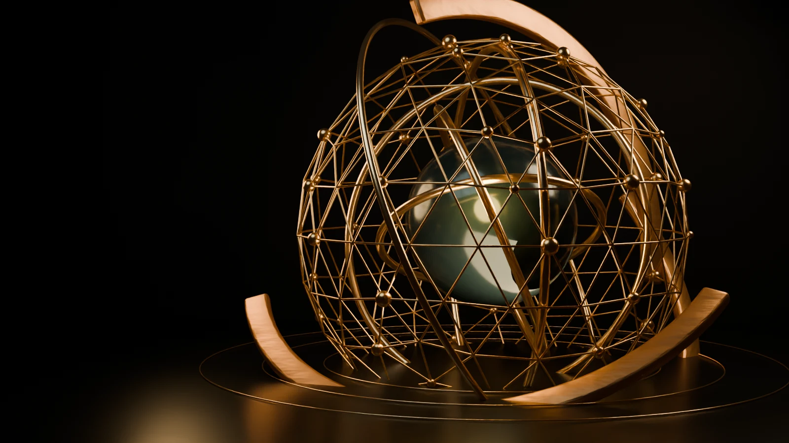
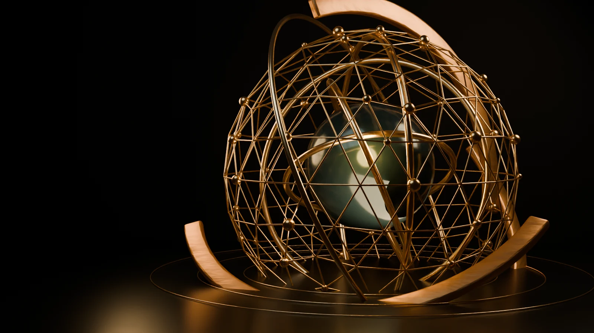

# TBM V10 — Continuous Cinematic Handoff and Forge VFX Implementation Plan

**Created:** 26 July 2026
**Status:** implementation plan only; no V10 production code or assets are activated by this document
**Authoritative baseline:** active V9 Cycles image-sequence implementation
**Local preview:** `http://127.0.0.1:4173/index.html`
**Primary objective:** preserve the approved V9 sculpture and grade while eliminating the reveal-to-homepage scene break, adding a continuously moving homepage sculpture, strengthening camera choreography, and replacing placeholder electricity/sparks/smoke with convincing forge effects.

---

## 1. Executive implementation decision

V10 must **not** rebuild or reinterpret the approved sculpture. The following V9 qualities are frozen:

- lacquered dark sphere;
- polished bronze inner rings;
- fine bronze network/mesh;
- forged outer-band geometry and roughness;
- current material colours;
- current scene exposure, contrast and brightness;
- current final right-weighted composition;
- Cycles as the delivery renderer;
- separately authored desktop and mobile cameras;
- reversible scroll mapping;
- Product Focus V7 constellation and its controller.

The remaining defects come from scene ownership and VFX construction:

1. The reveal canvas and homepage hero are separate document surfaces.
2. The homepage plate is a static image with no idle motion.
3. The camera makes one broad push/pull rather than a sequence of deliberate cinematic beats.
4. Electricity is represented by three persistent emissive curves.
5. Sparks are emissive icospheres rather than fast, directional embers.
6. Smoke is made from three static volumetric boxes with non-animated noise.

V10 will retain the V9 pre-rendered Cycles architecture and add:

- one persistent canvas shared by reveal and hero;
- an overlap/handoff interval where homepage content enters over that canvas;
- a separately rendered, seamless Cycles idle loop;
- multi-beat camera choreography authored entirely in Blender;
- contact-driven electrical arcs;
- ballistic ember/spark streaks with motion blur;
- animated, restrained smoke wisps;
- fixed visual gates after every major patch.

A live browser GLB is explicitly excluded. The rejected V8 implementation established that live WebGL material reconstruction does not preserve the accepted Cycles appearance.

---

## 2. Current-state evidence and root cause

### 2.1 Separate reveal and hero surfaces

Current `index.html` structure:

```html
<div class="tbm-reveal-v9-stage" data-reveal-stage>
  <div class="tbm-reveal-v6" id="tbm-reveal-v6">
    <canvas id="tbm-reveal-v6-canvas"></canvas>
  </div>
</div>
<main id="main-content">
  <section class="hero hero-v6 hero-v9">
    <figure class="hero-v9__plate">
      
    </figure>
  </section>
</main>
```

At reveal progress `1.0`, the reveal stage ends at the viewport bottom and the hero starts beneath it. Further scrolling moves the reveal upward and brings the hero into view. Reusing frame 120 prevents an asset mismatch, but does not make the visual spatially continuous.

### 2.2 Static homepage

`js/tbm-reveal-v9.js` calls `setHeroPlate()` and assigns a WebP to an ``. There is no hero animation timeline or idle render loop.

### 2.3 Camera motion

V9 desktop camera locations:

```python
frame 1:   (0.00, -15.10, 1.28)
frame 72:  (-.06, -13.90, 1.02)
frame 128: (.12, -12.58, .94)
frame 174: (.42, -14.05, .94)
frame 216: (.92, -16.72, .96)
```

This produces a broad push and pull. It lacks short focal beats, lateral parallax, close material inspection and a deliberate settle before the hero pose.

### 2.4 Placeholder effects

- `Electric_Arc_*`: fixed curves with deterministic sinusoidal jitter and scale animation.
- `Spark_Master` plus instances: small emissive icospheres moving radially.
- `create_smoke()`: three static cubes sharing a non-animated 4D noise material.

These mechanisms explain the white squiggles, white dots and static haze visible in the current reveal.

---

## 3. Research basis

### 3.1 Reference-site runtime

The current Swanson Reserve Capital homepage uses:

- a persistent hero `<canvas>`;
- Three.js/WebGL;
- GSAP;
- ScrollTrigger;
- ScrollSmoother.

Reference: <https://www.swansonreservecapital.com/>

Its continuity comes primarily from persistent scene ownership. V10 will reproduce that ownership pattern with the approved Cycles frame pipeline rather than replacing it with a live GLB.

### 3.2 Primary technical sources

- Blender camera and focal-length behaviour:
  <https://docs.blender.org/manual/en/latest/render/cameras.html>
- Blender particle emitter behaviour:
  <https://docs.blender.org/manual/en/latest/physics/particles/emitter/index.html>
- Blender Principled Volume:
  <https://docs.blender.org/manual/en/latest/render/shader_nodes/shader/volume_principled.html>
- Cycles motion blur:
  <https://docs.blender.org/manual/en/latest/render/cycles/render_settings/motion_blur.html>
- GSAP ScrollTrigger:
  <https://gsap.com/docs/v3/Plugins/ScrollTrigger/>

### 3.3 Skill discovery

`find-skills` searches returned:

- `mengto/skills@cinematic-scroll-storytelling`
- `mengto/skills@gsap-scrolltrigger-storytelling`
- `dylantarre/animation-principles@filmmaker`
- `roble3/cc-blender-skill@blender-animation`
- `roble3/cc-blender-skill@blender-cameras`

The MengTo repository has materially stronger public adoption/reputation than the Blender-specific results. Use the MengTo skills as optional scroll-storytelling review guidance. Use official Blender documentation as the implementation authority for cameras, particles, volumes and motion blur. No additional skill installation is required to implement V10.

---

## 4. Measurable acceptance criteria

### AC-01 — Preserve approved appearance

At the final reveal pose and first hero idle frame:

- V10 and V9 sphere/ring/mesh material classes must be visually unchanged.
- Whole-frame exposure difference must remain visually negligible.
- Object centre delta ≤ 1.0% of viewport.
- Object width/height delta ≤ 2.0%.
- Silhouette overlap ≥ 98%.
- No browser colour filter, material override or CSS scale correction.

### AC-02 — One continuous handoff

- No separate hero `` becomes visible during normal-motion mode.
- The reveal canvas remains the only sculpture surface from reveal frame 1 through hero idle.
- During the final 12% of reveal travel, hero copy begins entering over the canvas.
- At progress `1.0`, the canvas remains stationary while the hero is already visibly occupying the same viewport.
- Scrolling another 1–120px must not expose duplicated sculpture imagery or a black gap.
- Scrolling upward reverses the content handoff and reveal frames.

### AC-03 — Continuous homepage motion

- Idle animation begins from a pixel-matching frame equivalent to reveal frame 120.
- No visible pop when switching from reveal sequence to idle loop.
- Idle loop duration: 3–4 seconds at 24fps source timing.
- Ring motion: approximately 1–2 degrees per loop, distributed across separate ring groups.
- Core movement: restrained rotation/reflection change only; no translation that breaks composition.
- Mesh shimmer/node energy remains subtle.
- Idle pauses when the hero is outside the viewport or the page is hidden.
- `prefers-reduced-motion` uses the final static frame and no loop.

### AC-04 — Cinematic camera

Desktop reveal must include:

1. wide opening;
2. deliberate push toward core/band interaction;
3. short closer material-inspection beat;
4. lateral/orbital parallax during network assembly;
5. pull-back/rightward settle into the exact hero position.

No principal element may remain cropped for more than a short intentional close-up beat. Final composition must remain within the V9 contract.

### AC-05 — Forge VFX

- No persistent white zigzag curve.
- Electrical arcs appear only near meaningful band/core contact events.
- Arc colour: near-white/yellow core with amber falloff, not flat white.
- Sparks have directional streaking, varied lifetime and ballistic fall/rise.
- Majority of sparks are small; only occasional larger foreground streaks.
- Smoke visibly drifts and evolves, but never masks the sphere or network.
- No large flames. Warm contact glow and embers provide the forge identity.

### AC-06 — Performance and resilience

- Reveal remains reversible.
- First interaction still waits for a contiguous decoded frame window.
- Exact requested frames remain the policy during reveal.
- Idle loop is loaded after reveal-critical assets.
- No console/page errors or failed image requests.
- Resize and orientation change select the correct desktop/mobile source.
- Canvas rendering pauses on `document.hidden`.
- Static fallback works if manifest or idle assets fail.

---

## 5. Target file map

### Existing files to back up before any implementation edit

| File | Planned V10 role |
|---|---|
| `index.html` | persistent canvas/hero markup activation |
| `js/tbm-reveal-v9.js` | immutable V9 reference only; do not edit |
| `css/tbm-reference-refinement-v9.css` | immutable V9 reference only; do not edit |
| `blender/reference-match-v9/scripts/build_reference_match_v9.py` | immutable V9 reference only |
| `blender/reference-match-v9/config/scene-contract.json` | immutable V9 reference only |
| `tests/test_tbm_v9_visual.py` | immutable regression reference |

### Additive V10 files

| File | Purpose |
|---|---|
| `blender/reference-match-v10/scripts/build_reference_match_v10.py` | V9-derived camera/VFX/idle source |
| `blender/reference-match-v10/config/scene-contract.json` | V10 frames, idle and acceptance contract |
| `blender/reference-match-v10/TBM_REFERENCE_MATCH_V10.blend` | generated Blender source |
| `assets/tbm-cinematic-v10/reveal-desktop/` | corrected cinematic reveal |
| `assets/tbm-cinematic-v10/reveal-mobile/` | dedicated mobile reveal |
| `assets/tbm-cinematic-v10/idle-desktop/` | seamless hero idle frames |
| `assets/tbm-cinematic-v10/idle-mobile/` | dedicated mobile idle frames |
| `assets/tbm-cinematic-v10/frame-manifest.json` | reveal and idle source paths |
| `js/tbm-cinematic-v10.js` | one persistent canvas/controller |
| `css/tbm-cinematic-v10.css` | persistent-stage and content handoff layout |
| `tests/test_tbm_v10_visual.py` | transition, reverse, idle and fallback tests |
| `scripts/build-tbm-v10-approval-board.py` | V9/V10 fixed-checkpoint boards |
| `backup/v10_continuous_handoff_20260726/REVERT_TRACKING.md` | exact patch/restore register |

---

## 6. Mandatory backup and revert-tracking procedure

Before editing:

```powershell
$backupRoot = 'backup\v10_continuous_handoff_20260726'
$originals = Join-Path $backupRoot 'originals'
$working = Join-Path $backupRoot 'working-originals'
New-Item -ItemType Directory -Force -Path $originals,$working | Out-Null

Copy-Item -LiteralPath 'index.html' -Destination (Join-Path $originals 'index.html')
Copy-Item -LiteralPath 'js\tbm-reveal-v9.js' -Destination (Join-Path $originals 'tbm-reveal-v9.js')
Copy-Item -LiteralPath 'css\tbm-reference-refinement-v9.css' -Destination (Join-Path $originals 'tbm-reference-refinement-v9.css')
Copy-Item -LiteralPath 'blender\reference-match-v9\scripts\build_reference_match_v9.py' -Destination (Join-Path $originals 'build_reference_match_v9.py')
Copy-Item -LiteralPath 'blender\reference-match-v9\config\scene-contract.json' -Destination (Join-Path $originals 'scene-contract-v9.json')
Copy-Item -LiteralPath 'tests\test_tbm_v9_visual.py' -Destination (Join-Path $originals 'test_tbm_v9_visual.py')
```

Generate SHA-256 inventory for every backup. Create the V10 `REVERT_TRACKING.md` **before** the first implementation edit. After every patch:

1. record exact file and anchor;
2. record exact backup/restore source;
3. record validation command;
4. record screenshot/artifact path;
5. mark passed, corrected, rejected or pending;
6. do not begin the next major patch until the current visual gate passes.

---

## 7. Ordered implementation patches

## V10-R00 — Freeze and prove the V9 baseline

**No production changes.**

Capture:

- reveal 0%;
- reveal 25%;
- reveal 50%;
- reveal 75%;
- reveal 100%;
- boundary +30px;
- homepage hero;
- mobile 25%, 100% and hero.

Record source hashes for:

- V9 frame 120 desktop/mobile;
- V9 controller/CSS;
- V9 Blender builder/contract;
- `index.html`.

Run:

```powershell
node --check js\tbm-reveal-v9.js
python -m py_compile tests\test_tbm_v9_visual.py
python tests\test_tbm_v9_visual.py
```

**Gate:** baseline tests and captures must pass before V10 source creation.

---

## V10-R01 — Create V10 contract and V9-derived Blender source

Copy V9 source; do not start from an empty Blender scene.

### Contract diff

```diff
--- /dev/null
+++ b/blender/reference-match-v10/config/scene-contract.json
@@
+{
+  "name": "TBM V10 Continuous Cinematic Handoff",
+  "sourceBaseline": "reference-match-v9",
+  "fps": 24,
+  "frameStart": 1,
+  "frameEnd": 240,
+  "revealFrameCount": 132,
+  "idle": {
+    "frameStart": 241,
+    "frameEnd": 336,
+    "frameCount": 72,
+    "durationSeconds": 4,
+    "loopSeamTolerance": 0.008
+  },
+  "approvalFrames": {
+    "opening": 18,
+    "contactPush": 76,
+    "materialClose": 116,
+    "networkOrbit": 178,
+    "handoff": 240,
+    "idleQuarter": 264,
+    "idleHalf": 288,
+    "idleEnd": 336
+  },
+  "handoff": {
+    "contentRevealStart": 0.88,
+    "contentRevealEnd": 1.0,
+    "canvasReleaseAfterHero": 1.0
+  },
+  "render": {
+    "revealDesktop": [1600, 900],
+    "revealMobile": [900, 1600],
+    "idleDesktop": [1600, 900],
+    "idleMobile": [900, 1600],
+    "cyclesSamples": 32,
+    "webpQuality": 88,
+    "motionBlurShutter": 0.32
+  },
+  "frozenAppearance": {
+    "materials": [
+      "M_Black_Lacquered_Core",
+      "M_Forged_Outer_Brass",
+      "M_Polished_Bronze",
+      "M_Fine_Network_Bronze"
+    ],
+    "lights": ["Key_Cool", "Rim_Warm", "Rim_Amber", "Ground_Graze"],
+    "finalCompositionSource": "reference-match-v9/frame-216"
+  },
+  "web": {
+    "root": "assets/tbm-cinematic-v10",
+    "revealDesktop": "assets/tbm-cinematic-v10/reveal-desktop",
+    "revealMobile": "assets/tbm-cinematic-v10/reveal-mobile",
+    "idleDesktop": "assets/tbm-cinematic-v10/idle-desktop",
+    "idleMobile": "assets/tbm-cinematic-v10/idle-mobile"
+  }
+}
```

### Builder lineage diff

```diff
--- a/blender/reference-match-v9/scripts/build_reference_match_v9.py
+++ b/blender/reference-match-v10/scripts/build_reference_match_v10.py
@@
-CONTRACT_PATH = ROOT / "blender/reference-match-v9/config/scene-contract.json"
+CONTRACT_PATH = ROOT / "blender/reference-match-v10/config/scene-contract.json"
@@
-blend = ROOT / "blender/reference-match-v9/TBM_REFERENCE_MATCH_V9.blend"
+blend = ROOT / "blender/reference-match-v10/TBM_REFERENCE_MATCH_V10.blend"
```

**Frozen rule:** copy V9 material and light construction byte-for-byte initially. Camera/VFX/idle changes occur in later isolated patches.

**Validation:**

```powershell
python -m json.tool blender\reference-match-v10\config\scene-contract.json
python -m py_compile blender\reference-match-v10\scripts\build_reference_match_v10.py
```

---

## V10-R02 — Author cinematic camera beats

### Desktop intent

| Beat | Source frames | Camera action |
|---|---:|---|
| Establish | 1–42 | wide, quiet opening; core emergence readable |
| Contact push | 43–88 | controlled dolly toward core/band interaction |
| Material close | 89–132 | closest view; slight lateral move for bronze/core parallax |
| Network orbit | 133–194 | pull slightly back and arc laterally as mesh draws |
| Hero settle | 195–240 | pull back/right into exact V9 final composition |

### Proposed camera patch

```diff
--- a/blender/reference-match-v10/scripts/build_reference_match_v10.py
+++ b/blender/reference-match-v10/scripts/build_reference_match_v10.py
@@
-keyframe_transform(camera, 1, location=(0, -15.10, 1.28))
-keyframe_transform(camera, 72, location=(-.06, -13.90, 1.02))
-keyframe_transform(camera, 128, location=(.12, -12.58, .94))
-keyframe_transform(camera, 174, location=(.42, -14.05, .94))
-keyframe_transform(camera, 216, location=(.92, -16.72, .96))
+camera_keys = (
+    (1,   (0.00, -15.10, 1.28), 58),
+    (42,  (-.08, -14.62, 1.16), 58),
+    (76,  (.08, -12.96, 1.00), 61),
+    (104, (-.18, -12.28, .91), 64),
+    (116, (.24, -11.96, .88), 66),
+    (132, (.34, -12.42, .90), 64),
+    (160, (.68, -13.30, .96), 61),
+    (178, (.86, -14.18, 1.00), 59),
+    (210, (.96, -15.48, .98), 58),
+    (240, (.92, -16.72, .96), 58),
+)
+for frame, location, lens in camera_keys:
+    keyframe_transform(camera, frame, location=location)
+    camera.data.lens = lens
+    camera.data.keyframe_insert(data_path="lens", frame=frame)
```

The final frame values remain identical to V9. Lens changes are restrained; they enhance focal emphasis without producing a conspicuous “Vertigo” effect.

### Target movement

Add several target keys so the camera looks toward the active assembly region, then returns to the V9 final target:

```python
target_keys = (
    (1,   (0.00, 0, .20)),
    (76,  (-.10, 0, .08)),
    (116, (.18, 0, .12)),
    (178, (-.58, 0, .18)),
    (240, (-1.28, 0, .15)),
)
```

### Mobile

Author separate mobile positions using the same beat timing. Do not crop desktop. Mobile may use less lateral movement to prevent edge clipping.

### Visual gate

Render only fixed checkpoints first:

- desktop/mobile opening;
- contact push;
- material close;
- network orbit;
- final handoff.

Reject or correct camera keys before generating the complete sequence.

---

## V10-R03 — Replace electricity with contact-driven branching arcs

Remove the three persistent curves. Introduce short-lived arc families tied to actual contact events.

```diff
--- a/blender/reference-match-v10/scripts/build_reference_match_v10.py
+++ b/blender/reference-match-v10/scripts/build_reference_match_v10.py
@@
-# Electricity paths bridge initial forged-band tips toward the core.
-for arc_index, (start, end) in enumerate(...):
-    ...
-    keyframe_transform(arc, arc_start, scale=(1, 1, 1))
-    keyframe_transform(arc, 166 + arc_index * 3, scale=(.18, .18, .18))
+def create_contact_arc(name, start, end, start_frame, seed, target):
+    rng = random.Random(seed)
+    points = []
+    for segment in range(28):
+        ratio = segment / 27
+        envelope = math.sin(ratio * math.pi)
+        jitter = Vector((
+            rng.uniform(-.10, .10),
+            rng.uniform(-.045, .045),
+            rng.uniform(-.10, .10),
+        )) * envelope
+        points.append(Vector(start).lerp(Vector(end), ratio) + jitter)
+    arc = add_curve(name, points, electric_material, target, bevel=.006)
+    arc.data.bevel_factor_end = 0.0
+    arc.data.keyframe_insert(data_path="bevel_factor_end", frame=start_frame)
+    arc.data.bevel_factor_end = 1.0
+    arc.data.keyframe_insert(data_path="bevel_factor_end", frame=start_frame + 2)
+    arc.hide_render = False
+    arc.keyframe_insert(data_path="hide_render", frame=start_frame + 5)
+    return arc
+
+contact_events = (
+    ("Contact_A", band_tip_a, core_contact_a, 54),
+    ("Contact_B", band_tip_b, core_contact_b, 72),
+    ("Contact_C", orbit_contact, core_contact_c, 104),
+    ("Contact_D", network_contact, core_contact_d, 166),
+)
+for event_index, (name, start, end, frame) in enumerate(contact_events):
+    create_contact_arc(name, start, end, frame, 20261000 + event_index, vfx_electric)
+    create_contact_arc(f"{name}_Branch", start, Vector(end) + Vector((.12,0,.08)),
+                       frame + 1, 20262000 + event_index, vfx_electric)
```

Material recommendation:

- centre emission: `#fff1c6`;
- amber edge/glow: `#ff9f32`;
- smaller bevel;
- compositor glare limited to arcs/contact points;
- local point-light pulse of 2–4 frames.

**Art-direction constraint:** arcs are accents, not a permanent halo. At most two principal arc families should be visible simultaneously.

---

## V10-R04 — Replace spark spheres with ballistic ember streaks

Use a particle/Geometry Nodes or deterministic object-instancing system with:

- emission at band/core contact points;
- initial directional velocity;
- gravity;
- drag;
- varied lifespan;
- elongated geometry aligned to velocity;
- Cycles motion blur.

Illustrative deterministic implementation:

```diff
--- a/blender/reference-match-v10/scripts/build_reference_match_v10.py
+++ b/blender/reference-match-v10/scripts/build_reference_match_v10.py
@@
-bpy.ops.mesh.primitive_ico_sphere_add(subdivisions=1, radius=.025, location=location)
+bpy.ops.mesh.primitive_cylinder_add(
+    vertices=8,
+    radius=.008,
+    depth=.11,
+    location=origin,
+)
@@
-location = Vector((math.cos(angle) * distance, ...))
-keyframe_transform(spark, min(188, start + 32), location=...)
+velocity = Vector((
+    rng.uniform(-1.4, 1.4),
+    rng.uniform(-.25, .25),
+    rng.uniform(.8, 2.4),
+))
+gravity = Vector((0, 0, -2.6))
+for step in (0, 3, 7, 12):
+    seconds = step / CONTRACT["fps"]
+    point = origin + velocity * seconds + .5 * gravity * seconds * seconds
+    keyframe_transform(ember, start + step, location=point)
+keyframe_transform(ember, start + lifetime, scale=(.001, .001, .001))
```

Orient each ember along velocity (`to_track_quat`) and enable:

```python
scene.render.use_motion_blur = True
scene.render.motion_blur_shutter = CONTRACT["render"]["motionBlurShutter"]
```

Distribution:

- 70% tiny background embers;
- 25% medium visible sparks;
- 5% larger foreground streaks;
- warm white at birth, amber/orange as they decay;
- emission bursts clustered around contact events, not uniform throughout the reveal.

---

## V10-R05 — Replace static smoke with animated wisps

Preserve the current dark scene and material readability. Smoke should provide depth separation, not fog the sculpture.

```diff
--- a/blender/reference-match-v10/scripts/build_reference_match_v10.py
+++ b/blender/reference-match-v10/scripts/build_reference_match_v10.py
@@
 def create_smoke(target):
@@
     noise.noise_dimensions = "4D"
+    noise.inputs["W"].default_value = 0.0
+    noise.inputs["W"].keyframe_insert(data_path="default_value", frame=1)
+    noise.inputs["W"].default_value = 2.4
+    noise.inputs["W"].keyframe_insert(data_path="default_value", frame=240)
@@
-    density.inputs[1].default_value = 0.018
+    density.inputs[1].default_value = 0.010
@@
-    smoke_volumes = (
-        ((0, 1.4, .55), (3.8, 2.2, 1.8)),
-        ((-2.9, 1.8, 1.0), (2.1, 1.5, 1.4)),
-        ((3.1, 2.0, 1.2), (2.6, 1.8, 1.6)),
-    )
+    smoke_volumes = (
+        ((0, 1.65, .20), (3.5, 1.5, .75), 0),
+        ((-2.6, 1.8, .65), (1.7, 1.1, .8), 20),
+        ((2.8, 1.9, .80), (1.9, 1.2, .9), 38),
+    )
@@
+        keyframe_transform(item, 1 + delay, location=location)
+        keyframe_transform(
+            item, 240,
+            location=(location[0] + .20, location[1], location[2] + .72),
+        )
```

Add a second higher-frequency noise layer to break up box-like volume boundaries. Keep density low and back/rim-light the wisps. Do not add large fire simulation domains unless fixed-keyframe reviews prove the restrained approach insufficient.

---

## V10-R06 — Author a seamless Cycles idle loop

The idle sequence starts from the exact final reveal state.

At frame 241:

- copy all frame-240 transforms;
- camera position, lens and target equal frame 240;
- material/light values equal frame 240.

From frames 241–336:

- core rotates slowly and returns to its start orientation;
- individual orbit groups rotate 1–2 degrees using sinusoidal/cyclic motion;
- cage remains structurally fixed;
- select network nodes pulse by no more than 8–12%;
- smoke noise `W` advances continuously;
- sparse embers loop without a burst at the seam.

The last frame must equal the first loop frame in principal transforms:

```python
def key_seamless_idle(item, data_path, start, midpoint, end):
    item.keyframe_insert(data_path=data_path, frame=start)
    # Apply restrained midpoint offset here.
    item.keyframe_insert(data_path=data_path, frame=midpoint)
    # Restore exact start value.
    item.keyframe_insert(data_path=data_path, frame=end)
```

Render `idleFrameCount + 1` during seam validation, compare first and last, then publish only the first `idleFrameCount` images.

### Manifest

```diff
--- /dev/null
+++ b/assets/tbm-cinematic-v10/frame-manifest.json
@@
+{
+  "version": 10,
+  "reveal": {
+    "frames": [
+      {
+        "desktop": "assets/tbm-cinematic-v10/reveal-desktop/frame_0001.webp",
+        "mobile": "assets/tbm-cinematic-v10/reveal-mobile/frame_0001.webp"
+      }
+    ]
+  },
+  "idle": {
+    "durationMs": 4000,
+    "frames": [
+      {
+        "desktop": "assets/tbm-cinematic-v10/idle-desktop/frame_0001.webp",
+        "mobile": "assets/tbm-cinematic-v10/idle-mobile/frame_0001.webp"
+      }
+    ]
+  }
+}
```

The actual manifest generator must enumerate all reveal and idle frames.

---

## V10-R07 — Implement one persistent canvas controller

Create `js/tbm-cinematic-v10.js`; do not mutate V9.

### Controller state machine

```text
loading-reveal
  → reveal-interactive
  → reveal-complete / hero-handoff
  → idle-loading
  → idle-playing
  → idle-paused

reverse scroll from handoff:
idle-playing → reveal-interactive
```

### Core logic

```diff
--- /dev/null
+++ b/js/tbm-cinematic-v10.js
@@
+const stage = document.querySelector('[data-cinematic-stage]');
+const hero = document.querySelector('.hero-v10');
+const canvas = document.getElementById('tbm-cinematic-v10-canvas');
+const context = canvas.getContext('2d', { alpha: false, desynchronized: true });
+const reducedMotion = matchMedia('(prefers-reduced-motion: reduce)');
+
+const state = {
+  mode: 'loading-reveal',
+  revealProgress: 0,
+  revealIndex: 0,
+  idleIndex: 0,
+  idleStartedAt: 0,
+  renderQueued: false,
+  visible: true,
+};
+
+function updateScrollState() {
+  const travel = Math.max(1, stage.offsetHeight - innerHeight);
+  state.revealProgress = clamp((scrollY - stage.offsetTop) / travel, 0, 1);
+  state.revealIndex = Math.round(state.revealProgress * (revealFrames.length - 1));
+  stage.style.setProperty('--handoff-progress',
+    clamp((state.revealProgress - .88) / .12, 0, 1).toFixed(4));
+
+  if (state.revealProgress < 1) {
+    state.mode = 'reveal-interactive';
+  } else if (idleReady) {
+    state.mode = 'idle-playing';
+    if (!state.idleStartedAt) state.idleStartedAt = performance.now();
+  } else {
+    state.mode = 'reveal-complete';
+  }
+  scheduleRender();
+}
+
+function render(now) {
+  if (state.mode === 'idle-playing' && state.visible && !document.hidden) {
+    const elapsed = (now - state.idleStartedAt) % idleDurationMs;
+    state.idleIndex = Math.floor(elapsed / idleDurationMs * idleFrames.length);
+    drawContain(idleFrames[state.idleIndex]);
+    requestAnimationFrame(render);
+    return;
+  }
+  drawContain(revealFrames[state.revealIndex]);
+}
+
+const heroObserver = new IntersectionObserver(entries => {
+  state.visible = entries.some(entry => entry.isIntersecting);
+  if (state.visible) scheduleRender();
+}, { threshold: .01 });
+heroObserver.observe(hero);
+
+document.addEventListener('visibilitychange', () => {
+  if (!document.hidden) {
+    state.idleStartedAt = performance.now();
+    scheduleRender();
+  }
+});
```

### Loading policy

- Reveal first 12 contiguous frames before interaction.
- Decode remaining reveal frames concurrently.
- Begin idle decoding only after reveal-critical frames or when progress exceeds 70%.
- Use exact frames for reveal.
- A skipped idle frame may use the latest decoded idle frame temporarily; this does not affect scroll accuracy.
- On idle failure, hold final reveal frame without hiding the page.

---

## V10-R08 — Restructure markup for a genuine handoff

The persistent canvas must own the reveal and hero viewport. Hero content is inside the same cinematic stage, rather than starting as an unrelated page below it.

```diff
--- a/index.html
+++ b/index.html
@@
-<div class="tbm-reveal-v9-stage" data-reveal-stage>
-  <div class="tbm-reveal-v6" id="tbm-reveal-v6">
-    <canvas class="tbm-reveal-v6__canvas" id="tbm-reveal-v6-canvas"></canvas>
-    ...
-  </div>
-</div>
-<main id="main-content">
-  <section class="hero hero-v6 hero-v9" id="top">
-    <figure class="hero-v6__plate hero-v9__plate">
-      
-    </figure>
-    ...
-  </section>
+<div class="tbm-cinematic-v10-stage" data-cinematic-stage data-reveal-stage>
+  <div class="tbm-cinematic-v10-visual" id="tbm-reveal-v6">
+    <canvas
+      class="tbm-cinematic-v10__canvas"
+      id="tbm-cinematic-v10-canvas"
+      aria-hidden="true"></canvas>
+    <div class="tbm-cinematic-v10__shade" aria-hidden="true"></div>
+    <div class="tbm-cinematic-v10__hud">...</div>
+  </div>
+  <section class="hero hero-v6 hero-v9 hero-v10" id="top">
+    <!-- No normal-motion sculpture image here. -->
+    <div class="hero-v10__fallback" aria-hidden="true">
+      <picture>
+        <source media="(max-width:700px)"
+          srcset="assets/tbm-cinematic-v10/reveal-mobile/frame_0132.webp">
+        
+      </picture>
+    </div>
+    ...existing hero content unchanged...
+  </section>
+</div>
+<main id="main-content">
@@
-<script type="module" src="js/tbm-reveal-v9.js"></script>
+<script type="module" src="js/tbm-cinematic-v10.js"></script>
```

Keep the original hero text, buttons, promises and proof strip unchanged.

Fallback picture rules:

- displayed only before canvas readiness, under reduced motion, or on controller failure;
- never simultaneously visible over the active canvas.

---

## V10-R09 — Persistent-stage CSS and content choreography

```diff
--- /dev/null
+++ b/css/tbm-cinematic-v10.css
@@
+.tbm-cinematic-v10-stage {
+  --handoff-progress: 0;
+  position: relative;
+  height: 480svh;
+  background: #020302;
+}
+
+.tbm-cinematic-v10-visual {
+  position: sticky;
+  top: 92px;
+  z-index: 1;
+  height: calc(100svh - 92px);
+  overflow: hidden;
+}
+
+.tbm-cinematic-v10__canvas {
+  display: block;
+  width: 100%;
+  height: 100%;
+}
+
+.hero-v10 {
+  position: sticky;
+  top: 92px;
+  z-index: 2;
+  height: calc(100svh - 92px);
+  min-height: 0;
+  margin-top: calc(-1 * (100svh - 92px));
+  background: transparent;
+  pointer-events: none;
+}
+
+.hero-v10 .hero-copy,
+.hero-v10 .proof-strip,
+.hero-v10 .hero-v6__phase {
+  opacity: var(--handoff-progress);
+  transform: translateY(calc((1 - var(--handoff-progress)) * 34px));
+}
+
+.hero-v10 .hero-actions,
+.hero-v10 a,
+.hero-v10 button {
+  pointer-events: auto;
+}
+
+.tbm-cinematic-v10-stage[data-mode="idle-playing"] .tbm-cinematic-v10__hud {
+  opacity: 0;
+  visibility: hidden;
+}
+
+.tbm-cinematic-v10-stage[data-ready="true"] .hero-v10__fallback {
+  opacity: 0;
+  visibility: hidden;
+}
```

Exact sticky/margin geometry must be tested at:

- 1904×900;
- 1680×900;
- 1366×768;
- 430×932;
- 390×844.

If `480svh` makes the reveal too long, adjust only after fixed-progress captures. Do not compensate using browser zoom.

---

## V10-R10 — Automated browser and asset tests

Create `tests/test_tbm_v10_visual.py`.

Required tests:

1. initial reveal ready;
2. forward 0 → 25 → 50 → 75 → 100;
3. at 100%, same canvas remains visible;
4. boundary +30px and +120px show no gap or duplicate object;
5. hero copy opacity rises during 88–100%;
6. idle frame changes while hero is visible;
7. scroll reverse returns to earlier reveal frames;
8. desktop/mobile source selection;
9. resize desktop → mobile and mobile → desktop;
10. reduced-motion fallback;
11. manifest failure fallback;
12. idle failure holds final reveal frame;
13. page visibility pause/resume;
14. no console/page/request failures;
15. Product Focus remains unchanged.

Key assertions:

```python
assert page.locator("#tbm-cinematic-v10-canvas").count() == 1
assert page.locator(".hero-v10__plate img").count() == 0
assert page.locator("[data-cinematic-stage]").get_attribute("data-mode") == "idle-playing"

frame_a = page.locator("[data-cinematic-stage]").get_attribute("data-idle-frame")
page.wait_for_timeout(250)
frame_b = page.locator("[data-cinematic-stage]").get_attribute("data-idle-frame")
assert frame_a != frame_b
```

Use screenshot evidence at every fixed transition point.

---

## V10-R11 — Approval boards and activation

Generate boards for:

- V9 vs V10 opening;
- V9 vs V10 material close;
- V9 vs V10 network;
- V9 vs V10 handoff;
- V10 reveal final vs V10 idle first;
- V10 idle first vs V10 idle seam;
- desktop boundary before/at/after handoff;
- mobile boundary before/at/after handoff.

Each board must contain:

- source labels;
- file hashes;
- A/B;
- 50/50 overlay;
- difference view where useful;
- approval status.

Only after all gates pass:

1. back up the then-current `index.html` again in `working-originals/`;
2. activate V10 CSS/JS and markup;
3. run the complete verification suite;
4. inspect the active browser when CDP 9223 is available;
5. leave human visual approval explicitly pending if only headless evidence exists.

---

## 8. Verification order after each major patch

### Source checks

```powershell
node --check js\tbm-cinematic-v10.js
python -m py_compile blender\reference-match-v10\scripts\build_reference_match_v10.py
python -m py_compile tests\test_tbm_v10_visual.py
python -m py_compile scripts\build-tbm-v10-approval-board.py
python -m json.tool blender\reference-match-v10\config\scene-contract.json
```

### Asset gate

- exact ordered reveal frame count per device;
- exact ordered idle frame count per device;
- expected dimensions;
- non-empty representative images;
- manifest/file parity;
- final reveal vs first idle seam comparison;
- first idle vs loop-end seam comparison.

### Runtime gate

```powershell
python tests\test_tbm_v10_visual.py
git diff --check
```

### Visual gate

Inspect:

- camera framing and crop;
- sphere/ring/mesh material preservation;
- exposure/brightness preservation;
- arc attachment and lifetime;
- spark colour, streaking and trajectory;
- smoke movement and opacity;
- reveal/hero continuity;
- idle-loop seam;
- Product Focus geometry.

Do not accept a patch merely because syntax/tests pass.

---

## 9. Rollback map

### Full V10 rollback

1. Restore `index.html` from:
   `backup/v10_continuous_handoff_20260726/originals/index.html`
2. Remove V10 imports from active HTML if a partial activation exists.
3. V9 JS/CSS remain untouched and can be reactivated directly.
4. V10 additive files/assets may remain archived or be removed after their paths are verified.

### Patch-specific rollback

| Patch | Revert |
|---|---|
| R01 | remove V10 Blender directory/contract |
| R02 | restore pre-camera V10 builder from `working-originals/` |
| R03 | restore pre-electricity V10 builder |
| R04 | restore pre-sparks V10 builder |
| R05 | restore pre-smoke V10 builder |
| R06 | restore pre-idle V10 builder/contract; remove idle assets |
| R07 | restore/remove V10 controller |
| R08 | restore `index.html` exact backup |
| R09 | restore/remove V10 CSS |
| R10 | remove additive V10 test |
| R11 | restore activation backup and reactivate V9 |

Every generated asset replacement must preserve the rejected candidate under the V10 backup directory before rerendering.

---

## 10. Explicit non-goals

V10 will not:

- change sphere, ring, mesh or outer-band design;
- alter approved materials, palette, exposure or brightness;
- rebuild the sculpture as a live GLB;
- add mouse interaction yet;
- redesign homepage copy, buttons or Product Focus;
- introduce large flames or a visually dominant fire simulation;
- add unrelated dependencies or framework migrations;
- declare human visual approval from headless screenshots.

---

## 11. Completion checklist

- [ ] V9 baseline captured and hashed.
- [ ] V10 backup root and detailed tracker created before edits.
- [ ] V10 derives directly from V9.
- [ ] Frozen material/light values verified.
- [ ] Cinematic camera checkpoints approved.
- [ ] White squiggles replaced by contact-driven arcs.
- [ ] Dot sparks replaced by ballistic ember streaks.
- [ ] Smoke evolves and drifts without masking the sculpture.
- [ ] Reveal delivery rendered and validated for desktop/mobile.
- [ ] Seamless idle loop rendered and validated for desktop/mobile.
- [ ] One persistent canvas owns reveal and hero.
- [ ] Hero content enters during the final reveal interval.
- [ ] No boundary gap, duplicate sculpture or section jump.
- [ ] Idle motion continues on the homepage.
- [ ] Reverse scroll restores reveal frames.
- [ ] Reduced-motion and failure fallbacks pass.
- [ ] Product Focus remains unchanged.
- [ ] Final source readback, syntax, asset, runtime and visual checks pass.
- [ ] `REVERT_TRACKING.md` contains exact anchors, restore paths and validation status.
- [ ] Headed-browser review completed, or explicitly left pending.

---

## 12. Recommended implementation sequence

Execute in this exact order:

1. V10-R00 — baseline and immutable backups.
2. V10-R01 — V10 source lineage and contract.
3. V10-R02 — camera checkpoints; review and correct.
4. V10-R03 — electricity; review and correct.
5. V10-R04 — sparks; review and correct.
6. V10-R05 — smoke; review and correct.
7. V10-R06 — idle loop; seam verification.
8. Render complete desktop/mobile assets.
9. V10-R07 — persistent controller.
10. V10-R08/R09 — markup and CSS handoff.
11. V10-R10 — browser regression suite.
12. V10-R11 — approval boards, activation and final audit.

No later phase begins when the current major visual patch produces a rejected output. Correct or revert that isolated patch first.
