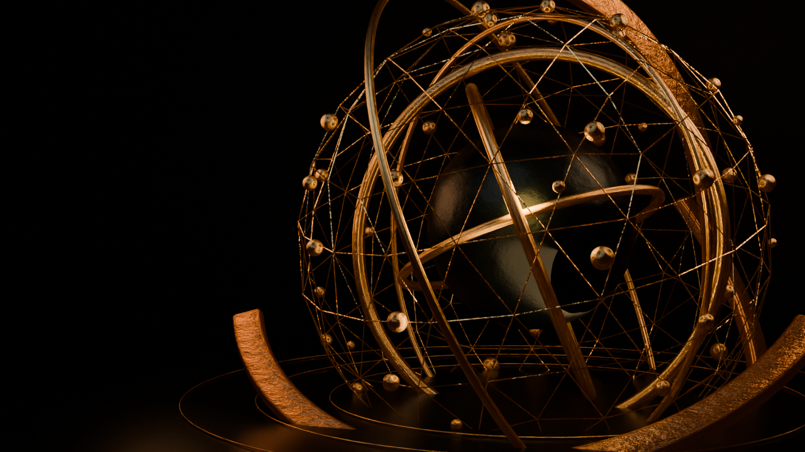
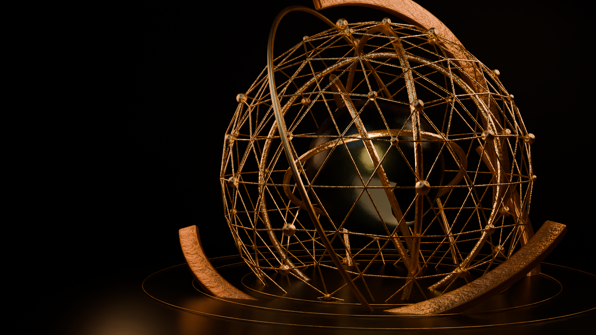

# The Blacksmith Market

## V7 Reveal, Hero Framing and Product Network Refinement PRD

**Date:** 25 July 2026  
**Status:** implementation-ready plan; no website implementation is performed by this document  
**Baseline:** the active V6 implementation in `index.html`, `js/tbm-reveal-v6.js`, `js/tbm-product-network-v6.js`, `css/tbm-reference-match-v6.css`, and `blender/reference-match/`  
**Extends:** `TBM_REFERENCE_MATCH_REBUILD_PRD_2026-07-25.md`  
**Supersedes only:** the baseline PRD’s V6 frame-count, reveal playback, camera-distance, lighting, reveal-timeline and Product Focus positioning specifications  
**Preserves:** approved copy, navigation, black/forged-metal visual direction, category names, filter labels, supplier-process messaging, and all V6 rollback assets

---

## 1. Required outcome

This pass must correct six specific problems without redesigning unrelated parts of the website:

1. The reveal must be reversible: scrolling back toward the top must scrub it backwards and make it visible again.
2. The reveal must move smoothly without reusing an old frame while the requested frame is still downloading.
3. The 3D sculpture must be slightly farther from the camera and remain inside a deliberate safe area at 100% browser zoom.
4. The delivered frames must be visibly sharper and moderately brighter, while retaining a black background and black core.
5. The formation must be longer and more intricate: outer forged pieces, core, rings, cage and nodes must assemble in readable stages rather than appearing suddenly.
6. The Product Focus cards must form a shallow, asymmetric constellation instead of a straight row. The cards must be slightly smaller, the central description block must sit farther below them, and the longer connecting lines must remain visible while the complete composition still fits in one 1904×900 desktop capture.

The result is a controlled refinement of V6, not a new visual concept.

---

## 2. Evidence from the active implementation

### 2.1 Reveal playback

The current controller starts by loading only frames 1–3:

```js
load(0);
load(1);
load(2);
```

When progress jumps to an unloaded frame, it uses the first available image:

```js
const frame = frames[current] || frames.find(Boolean) || load(0);
```

The requested `current` frame is not explicitly loaded in that fallback expression. The neighbouring preload list also omits `current`:

```js
const neighbourhood = [current - 2, current - 1, current + 1, current + 2, current + 3];
```

This creates a real playback defect: a wheel event can request frame 12 while the canvas temporarily redraws frame 1.

Runtime measurement at a 1904×900 viewport confirmed:

- the canvas was 1904×900;
- only frames 1–4 were available before interaction;
- after one 1100-pixel wheel delta, playback jumped to the network phase and requested frames 10, 11 and 13–15;
- frame 12—the calculated current frame—was not present in the network list at that moment.

### 2.2 Permanently released state

The current controller sets a one-way local flag:

```js
released = true;
reveal.classList.add('is-released');
```

All subsequent wheel and touch handling stops when `released` is true. No scroll-position calculation exists that can restore the reveal.

### 2.3 Resolution and sampling

The active contract delivers:

```json
{
  "reveal": [960, 540],
  "sequenceSamples": 8,
  "revealFrameCount": 24
}
```

At the tested 1904×900 viewport, a 960-pixel source is enlarged to approximately twice its native width. Browser zoom at 75% appears smoother because fewer display pixels are being filled by each source pixel; the underlying asset does not become higher quality.

### 2.4 Camera and crop

Current camera positions:

```python
keyframe_transform(camera, 1, location=(0, -12.6, 1.2))
keyframe_transform(camera, 58, location=(.22, -10.9, .85))
keyframe_transform(camera, 108, location=(.85, -14.2, .88))
```

The middle phase moves significantly closer than the opening and final positions. The settled hero is also displayed with `object-fit: cover`, which introduces viewport-dependent cropping.

### 2.5 Lighting

Current hero lighting was intentionally reduced during V6 correction:

```python
Key_Cool = 72
Rim_Warm = 128
Rim_Amber = 54
Ground_Graze = 32
```

The settled hero receives another browser-side reduction:

```css
filter:saturate(.92) contrast(1.08) brightness(.86)
```

The combined render and browser grading is darker than the desired midpoint.

### 2.6 Abrupt formation

The entire sequence covers Blender frames 1–108 but only 24 web frames are exported. Each delivered image therefore skips approximately 4.65 Blender frames.

Several objects animate mainly from almost-zero scale directly to full scale:

```python
keyframe_transform(cage, 1, scale=(.001, .001, .001))
keyframe_transform(cage, 63, scale=(1, 1, 1))
```

This explains why the cage and rings appear to form suddenly even though Blender interpolates between their keyframes.

---

## 3. V7 production decisions

### 3.1 Separate V7 files

V6 must remain untouched as the complete rollback version. V7 will be implemented through new files plus a small activation patch in `index.html`.

| Change ID | V7 target | Source/backup relationship | Revert action |
|---|---|---|---|
| V7-R01 | `blender/reference-match-v7/config/scene-contract.json` | derived from V6 contract | remove V7 file |
| V7-R02 | `blender/reference-match-v7/scripts/build_reference_match_v7.py` | derived from V6 build script | remove V7 file |
| V7-R03 | `blender/reference-match-v7/TBM_REFERENCE_MATCH_V7.blend` | generated file | remove V7 file |
| V7-R04 | `assets/tbm-cinematic-v7/**` | generated assets | remove V7 directory |
| V7-R05 | `js/tbm-reveal-v7.js` | replaces active V6 controller only | restore V6 script tag |
| V7-R06 | `js/tbm-product-network-v7.js` | derives from current product controller | restore V6 script tag |
| V7-R07 | `css/tbm-reference-refinement-v7.css` | narrow override loaded after V6 CSS | remove stylesheet link |
| V7-R08 | `index.html` | only existing production file modified | restore exact backup copy |
| V7-R09 | `tests/test_tbm_v7_visual.py` | new validation file | remove test |
| V7-R10 | `backup/reference_refinement_v7_YYYYMMDD/REVERT_TRACKING.md` | implementation journal | retain permanently |

### 3.2 Render architecture

- Continue using Blender Cycles and a pre-rendered image sequence.
- Do not introduce a live Three.js model into the reveal.
- Export 96 desktop and 96 mobile frames from a 192-frame Blender timeline.
- Render desktop sequence frames at 1600×900 and mobile frames at 900×1600.
- Render the settled hero plate at 1920×1080.
- Use 24 Cycles samples for sequence frames with denoising and 128 samples for approval keyframes.
- Keep WebP for predictable canvas support; target quality 86.
- Preload and decode every selected-device frame before enabling scrubbing.
- If the V7 asset budget is exceeded, reduce WebP quality before reducing frame count or resolution.

### 3.3 Performance budget

| Asset group | Budget |
|---|---:|
| 96 desktop frames | ≤ 24 MB total |
| 96 mobile frames | ≤ 18 MB total |
| One sequence frame | ≤ 320 KB |
| Settled hero plate | ≤ 2.5 MB |
| Manifest | ≤ 20 KB |
| Decode-ready wait on local preview | ≤ 4 seconds |
| Scrub frame interval at tested desktop viewport | median ≤ 18 ms; p95 ≤ 28 ms |

---

## 4. Reveal interaction specification

### 4.1 Scroll model

The reveal becomes a real scroll section rather than a permanently fixed modal.

- Header remains visible.
- Reveal stage occupies `320svh`.
- Reveal canvas is sticky below the 92-pixel desktop header.
- Progress is derived from the stage’s actual scroll position.
- Scrolling down moves from progress 0 to 1.
- Scrolling upward moves from progress 1 back to 0.
- Leaving the stage below reveals the homepage naturally.
- Returning upward into the stage restores the final frame and scrubs backwards.
- “Skip reveal” scrolls to the end of the stage; it does not destroy the reveal state.
- Reduced-motion mode removes the stage and shows the settled homepage immediately.

### 4.2 Playback smoothing

Maintain two progress values:

- `targetProgress`: exact progress derived from scroll position.
- `displayProgress`: eased progress rendered by the canvas.

Use a timestamp-based exponential interpolation in a continuous `requestAnimationFrame` loop:

```js
const alpha = 1 - Math.exp(-elapsed / 70);
displayProgress += (targetProgress - displayProgress) * alpha;
```

This prevents large wheel deltas from causing immediate multi-frame jumps.

### 4.3 Decode policy

Each frame must be downloaded as a `Blob` and converted with `createImageBitmap()`. The reveal becomes interactive only after every frame for the active viewport has decoded.

No fallback to an unrelated old frame is permitted. If the requested frame is unavailable because of a genuine failure, display the closest successfully decoded index:

```js
function closestDecodedIndex(requested) {
  for (let distance = 0; distance < frames.length; distance += 1) {
    const before = requested - distance;
    const after = requested + distance;
    if (frames[before]) return before;
    if (frames[after]) return after;
  }
  return 0;
}
```

---

## 5. V7 Blender storyboard

Timeline: 192 Blender frames at 24 fps, equivalent to 8 seconds when played linearly.

### Phase A — latent forge, frames 1–30

- Floor rings and faint reflections are visible.
- Central core begins below the floor plane at 8% scale.
- Outer forged pieces are visible at the frame edges, not yet connected.
- Sparse dust and smoke move through the light.
- Two faint electrical probes establish the future connection points.

### Phase B — outer forged movement, frames 31–76

- Three large bent pieces move independently along curved approach paths.
- Each piece rotates on more than one axis.
- Each arrival has a small overshoot followed by a controlled settle.
- Contact produces a local spark burst, a short electrical arc and a brief warm light pulse.
- The core rises slowly and becomes reflective before reaching full size.

### Phase C — orbital assembly, frames 68–118

- Inner rings do not scale from nothing.
- Each ring grows along its curve using `bevel_factor_end` or an equivalent trimmed-curve reveal.
- Ring starts are staggered by 8–10 frames.
- The first ring crosses in front of the core; the second passes behind it; later rings establish depth.
- The central sphere’s final reflection develops during this phase.

### Phase D — network formation, frames 104–158

- Cage edges grow progressively in batches rather than appearing as one wireframe object.
- Network nodes appear after the edge reaching them becomes visible.
- Every fourth or fifth node receives a restrained emissive pulse.
- Edge growth order radiates from three connection areas rather than using a random sequence.

### Phase E — charge and handoff, frames 150–192

- Outer halo completes.
- Electrical arcs become thinner and less frequent.
- A final particle wave travels outward.
- Camera settles into the approved homepage framing.
- Final frame holds for eight Blender frames to make the handoff calm and readable.

---

## 6. Camera, material and lighting contract

### 6.1 Camera distance

Pull the camera back approximately 11–13% without making the concept-image mistake of leaving the sculpture too small.

Proposed positions:

```python
frame 1:   (0.00, -14.20, 1.25)
frame 96:  (0.20, -12.35, 0.92)
frame 192: (0.82, -15.85, 0.92)
```

Keep the 58 mm lens for consistent perspective. Do not simultaneously widen the lens unless the framing tests still crop the outer pieces.

### 6.2 Safe-area requirement

At 100% browser zoom:

- no important outer band may cross the top, bottom or right crop boundary;
- minimum visual safe margin is 6% of image width/height;
- the final sculpture occupies approximately 57–62% of desktop width;
- its leftmost important geometry stays to the right of the hero copy safe column;
- test at 1366×768, 1904×900 and 2560×1440.

### 6.3 Sphere

- Reduce roughness from `0.26` to `0.21`.
- Reduce black-core bump strength from `0.15` to `0.10`.
- Preserve subtle forged variation; do not turn the core into a perfectly clean plastic sphere.
- Add one controlled cool reflection and one small warm reflection.

### 6.4 Light adjustment

Increase selective highlights rather than applying a global brightness filter:

```text
Key_Cool:     72  → 88
Rim_Warm:    128 → 160
Rim_Amber:    54 → 66
Ground_Graze: 32 → 40
Contact peak: 72 → 90
```

The background remains at the current near-black world strength.

### 6.5 Browser grade

Change settled hero browser grading from:

```css
brightness(.86)
```

to:

```css
brightness(.94)
```

Do not raise the reveal canvas using CSS; reveal lighting must be corrected in Blender.

---

## 7. Product Focus constellation design

### 7.1 Visual direction

Use a shallow asymmetric constellation that combines the current five-card interaction with the network logic in the supplied reference.

It must not become:

- a perfectly straight row;
- a circular radial menu;
- the widely scattered category labels shown in the supplied reference;
- a large diagram requiring horizontal or vertical scrolling.

### 7.2 Desktop card positions

Use a ten-column grid and five persistent slots:

| Card | Grid columns | Vertical offset |
|---|---:|---:|
| Beauty & Personal Care | 1–2 | +14 px |
| Home & Kitchen | 3–4 | −18 px |
| Toys & Games | 5–6 | +4 px |
| Consumer Electronics | 7–8 | −28 px |
| General Merchandise | 9–10 | +12 px |

This produces a restrained, irregular constellation while preserving a clear left-to-right scan.

### 7.3 Card dimensions

- Standard card minimum height: 320 px instead of 407 px.
- Selected card minimum height: 354 px instead of 474 px.
- Standard radius: 11 px.
- Selected lift: 16 px.
- Selected scale: 1.025.
- Adjacent cards receive a 4-pixel sympathetic lift.
- Text and hit targets remain unchanged.

### 7.4 Description-block distance

- Increase visual distance between card bottoms and the central detail block from 22 px to 76 px.
- The detail block must remain centered beneath the active card network.
- Maximum detail-block height: 138 px at 1904×900.
- Connecting lines remain visible through the increased gap.
- Route lines must not pass behind text.

### 7.5 Connecting-line geometry

Change the SVG canvas from `1200×560` to `1200×620`.

Proposed card anchors:

```text
Beauty:      (115, 205)
Home:        (335, 155)
Toys:        (560, 195)
Electronics: (785, 145)
General:     (1060, 205)
Common hub:  (600, 545)
```

Minimum exposed route length between a card and the common hub: 110 CSS pixels at 1904×900.

The active route remains brighter, dashed and animated. Passive routes remain thin and dark gold.

### 7.6 Filter and selection motion

- Selecting a card changes the active route and description as it does now.
- Filters continue hiding non-matching cards.
- Visible cards receive new layout slots based on visible count so filtered states remain centred.
- Use the View Transitions API when supported; retain an immediate functional fallback.
- Motion duration: 420 ms.
- Motion easing: `cubic-bezier(.22,.72,.18,1)`.
- Reduced-motion mode performs an immediate state change.

### 7.7 Single-shot requirement

At 1904×900 and 100% zoom, one screenshot beginning below the sticky header must contain:

- Product Focus eyebrow and heading;
- filter bar;
- all five card bodies;
- exposed connecting lines;
- central detail block;
- connected-evaluation callout and active-connection legend.

No part of the detail block may fall below the screenshot.

On viewports shorter than 800 pixels, fitting everything into one shot is not required; functional scrolling takes priority.

---

## 8. Exact implementation patches

These diffs are specifications for the implementation pass. Apply them only after creating the backup directory and V7 copies listed in section 10.

### Patch V7-R01 — new render contract

Create `blender/reference-match-v7/config/scene-contract.json` from the V6 contract, then apply:

```diff
--- a/blender/reference-match/config/scene-contract.json
+++ b/blender/reference-match-v7/config/scene-contract.json
@@
-  "name": "TBM Reference Match V6",
+  "name": "TBM Reference Match V7",
   "fps": 24,
   "frameStart": 1,
-  "frameEnd": 108,
+  "frameEnd": 192,
   "render": {
-    "keyframes": [1280, 720],
-    "reveal": [960, 540],
+    "keyframes": [1920, 1080],
+    "reveal": [1600, 900],
+    "revealMobile": [900, 1600],
     "cards": [640, 820],
-    "keyframeSamples": 96,
-    "sequenceSamples": 8,
+    "keyframeSamples": 128,
+    "sequenceSamples": 24,
     "cardSamples": 48,
-    "revealFrameCount": 24
+    "revealFrameCount": 96,
+    "revealWebpQuality": 86
@@
-    "root": "assets/tbm-cinematic-v6",
-    "desktopReveal": "assets/tbm-cinematic-v6/reveal-desktop",
-    "mobileReveal": "assets/tbm-cinematic-v6/reveal-mobile",
-    "posters": "assets/tbm-cinematic-v6/posters",
-    "productFocus": "assets/tbm-cinematic-v6/product-focus"
+    "root": "assets/tbm-cinematic-v7",
+    "desktopReveal": "assets/tbm-cinematic-v7/reveal-desktop",
+    "mobileReveal": "assets/tbm-cinematic-v7/reveal-mobile",
+    "posters": "assets/tbm-cinematic-v7/posters",
+    "productFocus": "assets/tbm-cinematic-v7/product-focus"
```

### Patch V7-R02A — new Blender script paths and surface quality

Create `blender/reference-match-v7/scripts/build_reference_match_v7.py` from the V6 script, then apply:

```diff
--- a/blender/reference-match/scripts/build_reference_match.py
+++ b/blender/reference-match-v7/scripts/build_reference_match_v7.py
@@
-CONTRACT = json.loads((ROOT / "blender/reference-match/config/scene-contract.json").read_text(encoding="utf-8"))
+CONTRACT = json.loads((ROOT / "blender/reference-match-v7/config/scene-contract.json").read_text(encoding="utf-8"))
@@
-    bump.inputs["Strength"].default_value = 0.15 if black else 0.28
+    bump.inputs["Strength"].default_value = 0.10 if black else 0.28
@@
-    black = metal_material("M_Black_Forged_Core", "#030506", 0.26, black=True)
+    black = metal_material("M_Black_Forged_Core", "#030506", 0.21, black=True)
```

### Patch V7-R02B — animation smoothing helper

Add immediately after `keyframe_transform()`:

```diff
--- a/blender/reference-match-v7/scripts/build_reference_match_v7.py
+++ b/blender/reference-match-v7/scripts/build_reference_match_v7.py
@@
 def keyframe_transform(item, frame, location=None, rotation=None, scale=None):
@@
         item.scale = scale
         item.keyframe_insert(data_path="scale", frame=frame)
+
+
+def apply_smooth_fcurves():
+    """Use clamped Bezier handles so assembly moves smoothly without wild overshoot."""
+    for item in bpy.data.objects:
+        animation = item.animation_data
+        action = animation.action if animation else None
+        if not action:
+            continue
+        for curve in action.fcurves:
+            for point in curve.keyframe_points:
+                point.interpolation = "BEZIER"
+                point.handle_left_type = "AUTO_CLAMPED"
+                point.handle_right_type = "AUTO_CLAMPED"
```

Call it once at the end of `build_scene()`, before returning:

```diff
@@
-    return scene, camera, core
+    apply_smooth_fcurves()
+    return scene, camera, core
```

### Patch V7-R02C — longer core and outer-piece formation

```diff
--- a/blender/reference-match-v7/scripts/build_reference_match_v7.py
+++ b/blender/reference-match-v7/scripts/build_reference_match_v7.py
@@
-    keyframe_transform(core, 1, location=(0, 0, -1.35), rotation=(.18, -.42, .08), scale=(.12, .12, .12))
-    keyframe_transform(core, 27, location=(0, 0, .16), rotation=(.25, -.2, .2), scale=(.82, .82, .82))
-    keyframe_transform(core, 108, location=(0, 0, .16), rotation=(.35, .42, .62), scale=(.82, .82, .82))
+    keyframe_transform(core, 1, location=(0, 0, -1.62), rotation=(.18, -.42, .08), scale=(.08, .08, .08))
+    keyframe_transform(core, 30, location=(0, 0, -1.22), rotation=(.21, -.34, .12), scale=(.16, .16, .16))
+    keyframe_transform(core, 52, location=(0, 0, -.42), rotation=(.24, -.27, .16), scale=(.58, .58, .58))
+    keyframe_transform(core, 72, location=(0, 0, .20), rotation=(.27, -.18, .22), scale=(.86, .86, .86))
+    keyframe_transform(core, 192, location=(0, 0, .16), rotation=(.38, .48, .68), scale=(.82, .82, .82))
@@
-        keyframe_transform(band, 1, location=initial, rotation=(rotation[0] + .5, rotation[1] - .35, rotation[2] + .45), scale=(.62, .62, .62))
-        keyframe_transform(band, 31 + index * 6, location=(0, 0, 0), rotation=settled_rotation, scale=(1, 1, 1))
-        keyframe_transform(band, 108, location=(0, 0, 0), rotation=(rotation[0] + .07, rotation[1] + .11, rotation[2] + .18), scale=(1, 1, 1))
+        approach = 38 + index * 10
+        contact = 64 + index * 12
+        keyframe_transform(band, 1, location=initial, rotation=(rotation[0] + .72, rotation[1] - .52, rotation[2] + .64), scale=(.56, .56, .56))
+        keyframe_transform(band, approach, location=tuple(Vector(initial) * .42), rotation=(rotation[0] + .27, rotation[1] - .18, rotation[2] + .28), scale=(.84, .84, .84))
+        keyframe_transform(band, contact - 5, location=(.08 * (-1 if index % 2 else 1), 0, .05), rotation=(rotation[0] - .04, rotation[1] + .06, rotation[2] - .05), scale=(1.025, 1.025, 1.025))
+        keyframe_transform(band, contact, location=(0, 0, 0), rotation=settled_rotation, scale=(1, 1, 1))
+        keyframe_transform(band, 192, location=(0, 0, 0), rotation=(rotation[0] + .06, rotation[1] + .09, rotation[2] + .14), scale=(1, 1, 1))
```

### Patch V7-R02D — rings grow along their curves

After each torus is created, animate its bevel factor rather than its complete scale:

```diff
--- a/blender/reference-match-v7/scripts/build_reference_match_v7.py
+++ b/blender/reference-match-v7/scripts/build_reference_match_v7.py
@@
     for index, (major, minor, rotation) in enumerate(orbit_specs):
         orbit = add_torus(f"Inner_Orbit_{index + 1}", major, minor, rotation, polished, geo_orbits)
-        keyframe_transform(orbit, 1, scale=(.001, .001, .001))
-        keyframe_transform(orbit, 42 + index * 5, scale=(1, 1, 1), rotation=rotation)
-        keyframe_transform(orbit, 108, scale=(1, 1, 1), rotation=(rotation[0] + .32 * (index + 1), rotation[1] - .21 * (index + 1), rotation[2] + .25 * (index + 1)))
+        orbit.scale = (1, 1, 1)
+        reveal_start = 82 + index * 9
+        reveal_end = reveal_start + 24
+        # Torus geometry remains present; scale receives a subtle settle rather than a zero-to-one pop.
+        keyframe_transform(orbit, reveal_start, scale=(.86, .86, .86), rotation=(rotation[0] - .16, rotation[1] + .12, rotation[2] - .14))
+        keyframe_transform(orbit, reveal_end - 4, scale=(1.025, 1.025, 1.025), rotation=(rotation[0] + .03, rotation[1] - .02, rotation[2] + .04))
+        keyframe_transform(orbit, reveal_end, scale=(1, 1, 1), rotation=rotation)
+        keyframe_transform(orbit, 192, scale=(1, 1, 1), rotation=(rotation[0] + .24 * (index + 1), rotation[1] - .17 * (index + 1), rotation[2] + .20 * (index + 1)))
```

**Implementation note:** the existing `add_torus()` creates a mesh. During implementation, replace these four orbit meshes with bevelled Curve circles so `bevel_factor_end` can be animated from 0 to 1 over `reveal_start`–`reveal_end`. Do not accept the scale-only fallback at the animation approval gate.

Required curve animation:

```python
orbit.data.bevel_factor_start = 0.0
orbit.data.bevel_factor_end = 0.0
orbit.data.keyframe_insert(data_path="bevel_factor_end", frame=reveal_start)
orbit.data.bevel_factor_end = 1.0
orbit.data.keyframe_insert(data_path="bevel_factor_end", frame=reveal_end)
```

### Patch V7-R02E — progressive cage edges

Add this helper after `add_curve()`:

```diff
--- a/blender/reference-match-v7/scripts/build_reference_match_v7.py
+++ b/blender/reference-match-v7/scripts/build_reference_match_v7.py
@@
+def add_progressive_cage_edges(source, material, target):
+    """Convert cage edges into independently growing curves."""
+    result = []
+    vertices = [source.matrix_world @ vertex.co for vertex in source.data.vertices]
+    ordered_edges = sorted(
+        source.data.edges,
+        key=lambda edge: min(vertices[edge.vertices[0]].z, vertices[edge.vertices[1]].z),
+    )
+    for index, edge in enumerate(ordered_edges):
+        points = [vertices[edge.vertices[0]], vertices[edge.vertices[1]]]
+        line = add_curve(f"Network_Edge_{index:03d}", points, material, target, bevel=.013)
+        line.data.bevel_factor_start = 0.0
+        line.data.bevel_factor_end = 0.0
+        start = 108 + (index % 42)
+        end = start + 14
+        line.data.keyframe_insert(data_path="bevel_factor_end", frame=start)
+        line.data.bevel_factor_end = 1.0
+        line.data.keyframe_insert(data_path="bevel_factor_end", frame=end)
+        result.append(line)
+    return result
```

Replace the renderable wireframe cage with progressive edges while retaining the hidden mesh for vertex/node positions:

```diff
@@
     cage = bpy.context.object
     cage.name = "Network_Cage"
+    cage.hide_render = True
@@
-    keyframe_transform(cage, 1, scale=(.001, .001, .001))
-    keyframe_transform(cage, 63, scale=(1, 1, 1), rotation=(0, 0, 0))
-    keyframe_transform(cage, 108, scale=(1, 1, 1), rotation=(.15, -.22, .28))
+    progressive_edges = add_progressive_cage_edges(cage, polished, geo_cage)
```

### Patch V7-R02F — nodes, halo, electricity and sparks

```diff
--- a/blender/reference-match-v7/scripts/build_reference_match_v7.py
+++ b/blender/reference-match-v7/scripts/build_reference_match_v7.py
@@
-        keyframe_transform(node, 1, scale=(.001, .001, .001))
-        keyframe_transform(node, 60 + (index % 6) * 3, scale=(1, 1, 1))
-        keyframe_transform(node, 108, scale=(1.0 + (index % 3) * .1,) * 3)
+        arrival = 120 + (index % 10) * 4
+        keyframe_transform(node, arrival - 3, scale=(.001, .001, .001))
+        keyframe_transform(node, arrival, scale=(1.35, 1.35, 1.35))
+        keyframe_transform(node, arrival + 5, scale=(1, 1, 1))
+        keyframe_transform(node, 192, scale=(1.0 + (index % 3) * .07,) * 3)
@@
-    keyframe_transform(halo, 1, scale=(.001, .001, .001))
-    keyframe_transform(halo, 76, scale=(1, 1, 1))
-    keyframe_transform(halo, 108, rotation=(math.radians(66), math.radians(-4), math.radians(76)), scale=(1, 1, 1))
+    keyframe_transform(halo, 142, scale=(.001, .001, .001))
+    keyframe_transform(halo, 164, scale=(1.04, 1.04, 1.04))
+    keyframe_transform(halo, 170, scale=(1, 1, 1))
+    keyframe_transform(halo, 192, rotation=(math.radians(66), math.radians(-4), math.radians(76)), scale=(1, 1, 1))
@@
-        keyframe_transform(arc, 1, scale=(.001, .001, .001))
-        keyframe_transform(arc, 16 + arc_index * 5, scale=(1, 1, 1))
-        keyframe_transform(arc, 70 + arc_index * 3, scale=(.45, .45, .45))
+        arc_start = 34 + arc_index * 13
+        keyframe_transform(arc, arc_start - 2, scale=(.001, .001, .001))
+        keyframe_transform(arc, arc_start, scale=(1, 1, 1))
+        keyframe_transform(arc, arc_start + 20, scale=(.72, .72, .72))
+        keyframe_transform(arc, 166 + arc_index * 3, scale=(.18, .18, .18))
@@
-        start = 17 + index % 48
+        start = 28 + index % 118
@@
-        keyframe_transform(spark, 108, location=tuple(location * random.uniform(1.1, 1.65) + Vector((0, random.uniform(.1, 1.5), 0))), scale=(.001, .001, .001))
+        keyframe_transform(spark, min(188, start + 32), location=tuple(location * random.uniform(1.1, 1.65) + Vector((0, random.uniform(.1, 1.5), 0))), scale=(.001, .001, .001))
```

### Patch V7-R02G — camera and lighting

```diff
--- a/blender/reference-match-v7/scripts/build_reference_match_v7.py
+++ b/blender/reference-match-v7/scripts/build_reference_match_v7.py
@@
-    target.location = (-1.42, 0, .15)
-    target.keyframe_insert(data_path="location", frame=108)
+    target.location = (-1.28, 0, .15)
+    target.keyframe_insert(data_path="location", frame=192)
@@
-    keyframe_transform(camera, 1, location=(0, -12.6, 1.2))
-    keyframe_transform(camera, 58, location=(.22, -10.9, .85))
-    keyframe_transform(camera, 108, location=(.85, -14.2, .88))
+    keyframe_transform(camera, 1, location=(0, -14.20, 1.25))
+    keyframe_transform(camera, 96, location=(.20, -12.35, .92))
+    keyframe_transform(camera, 192, location=(.82, -15.85, .92))
@@
-    key = add_area("Key_Cool", (-3.1, -4.2, 5.4), 72, 5.2, "#c9e8ed", lights)
+    key = add_area("Key_Cool", (-3.1, -4.2, 5.4), 88, 5.2, "#c9e8ed", lights)
@@
-    rim = add_area("Rim_Warm", (4.4, .4, 3.8), 128, 3.4, "#ff9f58", lights)
+    rim = add_area("Rim_Warm", (4.4, .4, 3.8), 160, 3.4, "#ff9f58", lights)
@@
-    left_rim = add_area("Rim_Amber", (-4.4, .6, 1.5), 54, 2.6, "#e67335", lights)
+    left_rim = add_area("Rim_Amber", (-4.4, .6, 1.5), 66, 2.6, "#e67335", lights)
@@
-    floor_light = add_area("Ground_Graze", (0, -1.2, -.5), 32, 3.0, "#e58b42", lights, shape="RECTANGLE")
+    floor_light = add_area("Ground_Graze", (0, -1.2, -.5), 40, 3.0, "#e58b42", lights, shape="RECTANGLE")
@@
-    contact.data.energy = 72
+    contact.data.energy = 90
@@
-    contact.data.energy = 56
+    contact.data.energy = 68
-    contact.data.keyframe_insert(data_path="energy", frame=108)
+    contact.data.keyframe_insert(data_path="energy", frame=192)
```

### Patch V7-R02H — V7 outputs

```diff
--- a/blender/reference-match-v7/scripts/build_reference_match_v7.py
+++ b/blender/reference-match-v7/scripts/build_reference_match_v7.py
@@
-    targets = {"phase-ignition": 24, "phase-network": 62, "phase-handoff": 108}
+    targets = {"phase-ignition": 52, "phase-network": 132, "phase-handoff": 192}
@@
-    for output, dimensions in ((desktop, CONTRACT["render"]["reveal"]), (mobile, (540, 960))):
+    for output, dimensions in (
+        (desktop, CONTRACT["render"]["reveal"]),
+        (mobile, CONTRACT["render"]["revealMobile"]),
+    ):
@@
-            scene.render.image_settings.quality = 90
+            scene.render.image_settings.quality = CONTRACT["render"]["revealWebpQuality"]
@@
-    manifest = {"version": 6, "sampleCount": count, "frames": [{"desktop": f"assets/tbm-cinematic-v6/reveal-desktop/frame_{index:04d}.webp", "mobile": f"assets/tbm-cinematic-v6/reveal-mobile/frame_{index:04d}.webp"} for index in range(1, count + 1)]}
+    manifest = {
+        "version": 7,
+        "sampleCount": count,
+        "frames": [
+            {
+                "desktop": f"assets/tbm-cinematic-v7/reveal-desktop/frame_{index:04d}.webp",
+                "mobile": f"assets/tbm-cinematic-v7/reveal-mobile/frame_{index:04d}.webp",
+            }
+            for index in range(1, count + 1)
+        ],
+    }
@@
-    blend = ROOT / "blender/reference-match/TBM_REFERENCE_MATCH_MASTER.blend"
+    blend = ROOT / "blender/reference-match-v7/TBM_REFERENCE_MATCH_V7.blend"
```

### Patch V7-R05 — complete reveal controller replacement

Create `js/tbm-reveal-v7.js`:

```js
const revealStage = document.querySelector('[data-reveal-stage]');
const reveal = document.getElementById('tbm-reveal-v6');
const canvas = document.getElementById('tbm-reveal-v6-canvas');
const status = document.getElementById('tbm-reveal-v6-status');
const skip = document.getElementById('tbm-reveal-v6-skip');
const reducedMotion = window.matchMedia('(prefers-reduced-motion: reduce)');

if (revealStage && reveal && canvas && !reducedMotion.matches) {
  initialiseReveal().catch(disableReveal);
} else {
  disableReveal();
}

async function initialiseReveal() {
  const context = canvas.getContext('2d', { alpha: false, desynchronized: true });
  const response = await fetch('assets/tbm-cinematic-v7/frame-manifest.json', { cache: 'force-cache' });
  if (!response.ok) throw new Error(`Reveal manifest unavailable (${response.status})`);

  const manifest = await response.json();
  const mobile = window.matchMedia('(max-width: 700px)').matches;
  const sources = manifest.frames.map(frame => mobile ? frame.mobile : frame.desktop);
  const frames = new Array(sources.length);
  let targetProgress = 0;
  let displayProgress = 0;
  let previousTime = performance.now();
  let raf = 0;

  await decodeWithConcurrency(sources, frames, 6, count => {
    if (status) status.textContent = `Preparing the forge ${count}/${sources.length}`;
    reveal.style.setProperty('--load-progress', String(count / sources.length));
  });

  reveal.dataset.ready = 'true';
  if (status) status.textContent = 'Scroll to forge';
  resize();
  updateTarget();
  raf = requestAnimationFrame(renderLoop);

  window.addEventListener('resize', () => {
    resize();
    updateTarget();
  }, { passive: true });
  window.addEventListener('scroll', updateTarget, { passive: true });
  skip?.addEventListener('click', skipToEnd);

  function updateTarget() {
    const stageTop = revealStage.offsetTop;
    const available = Math.max(1, revealStage.offsetHeight - window.innerHeight);
    targetProgress = clamp((window.scrollY - stageTop) / available, 0, 1);
    reveal.dataset.progress = targetProgress.toFixed(4);
  }

  function renderLoop(time) {
    const elapsed = Math.min(64, time - previousTime);
    previousTime = time;
    const alpha = 1 - Math.exp(-elapsed / 70);
    displayProgress += (targetProgress - displayProgress) * alpha;
    if (Math.abs(targetProgress - displayProgress) < .0002) {
      displayProgress = targetProgress;
    }
    draw(indexFor(displayProgress));
    updatePhase(displayProgress);
    raf = requestAnimationFrame(renderLoop);
  }

  function indexFor(progress) {
    return Math.round(progress * (frames.length - 1));
  }

  function draw(index) {
    const frame = frames[index] || frames[closestDecodedIndex(frames, index)];
    if (!frame) return;
    const width = canvas.width;
    const height = canvas.height;
    const sourceRatio = frame.width / frame.height;
    const targetRatio = width / height;
    let drawWidth = width;
    let drawHeight = height;
    let x = 0;
    let y = 0;
    if (sourceRatio > targetRatio) {
      drawWidth = height * sourceRatio;
      x = (width - drawWidth) / 2;
    } else {
      drawHeight = width / sourceRatio;
      y = (height - drawHeight) / 2;
    }
    context.fillStyle = '#020302';
    context.fillRect(0, 0, width, height);
    context.drawImage(frame, x, y, drawWidth, drawHeight);
    reveal.style.setProperty('--forge-progress', displayProgress.toFixed(4));
    reveal.dataset.frame = String(index + 1);
  }

  function updatePhase(progress) {
    const phase = progress < .16 ? 'latent'
      : progress < .40 ? 'outer-forge'
      : progress < .64 ? 'orbits'
      : progress < .84 ? 'network'
      : 'handoff';
    reveal.dataset.phase = phase;
    if (!status) return;
    status.textContent = {
      latent: 'Preparing the forge',
      'outer-forge': 'Forging the outer system',
      orbits: 'Aligning the orbits',
      network: 'Structuring the network',
      handoff: 'Forged for clear decisions',
    }[phase];
  }

  function resize() {
    const bounds = reveal.getBoundingClientRect();
    const ratio = Math.min(window.devicePixelRatio || 1, 1.5);
    canvas.width = Math.max(1, Math.round(bounds.width * ratio));
    canvas.height = Math.max(1, Math.round(bounds.height * ratio));
    canvas.style.width = `${bounds.width}px`;
    canvas.style.height = `${bounds.height}px`;
  }

  function skipToEnd() {
    const destination = revealStage.offsetTop + revealStage.offsetHeight - window.innerHeight;
    window.scrollTo({ top: destination, behavior: reducedMotion.matches ? 'auto' : 'smooth' });
  }
}

async function decodeWithConcurrency(sources, target, concurrency, onProgress) {
  let cursor = 0;
  let completed = 0;
  async function worker() {
    while (cursor < sources.length) {
      const index = cursor;
      cursor += 1;
      const response = await fetch(sources[index], { cache: 'force-cache' });
      if (!response.ok) throw new Error(`Frame ${index + 1} unavailable (${response.status})`);
      target[index] = await createImageBitmap(await response.blob());
      completed += 1;
      onProgress(completed);
    }
  }
  await Promise.all(Array.from({ length: Math.min(concurrency, sources.length) }, worker));
}

function closestDecodedIndex(frames, requested) {
  for (let distance = 0; distance < frames.length; distance += 1) {
    const before = requested - distance;
    const after = requested + distance;
    if (before >= 0 && frames[before]) return before;
    if (after < frames.length && frames[after]) return after;
  }
  return 0;
}

function clamp(value, minimum, maximum) {
  return Math.min(maximum, Math.max(minimum, value));
}

function disableReveal() {
  revealStage?.setAttribute('hidden', '');
  document.body.classList.remove('tbm-v6-pending');
}
```

### Patch V7-R07A — reversible reveal CSS

Create `css/tbm-reference-refinement-v7.css`:

```css
.tbm-reveal-v7-stage {
  position: relative;
  height: 320svh;
  background: #020302;
}

.tbm-reveal-v7-stage .tbm-reveal-v6 {
  position: sticky;
  top: 92px;
  z-index: 60;
  width: 100%;
  height: calc(100svh - 92px);
  opacity: 1;
  visibility: visible;
  pointer-events: auto;
}

.tbm-reveal-v7-stage .tbm-reveal-v6__canvas {
  width: 100%;
  height: 100%;
}

.tbm-reveal-v7-stage .tbm-reveal-v6__shade {
  background:
    radial-gradient(ellipse at 52% 55%, transparent 22%, rgba(2,3,2,.08) 58%, rgba(2,3,2,.56) 100%);
}

.hero-v6__plate img {
  filter: saturate(.96) contrast(1.07) brightness(.94);
}

@media (max-width: 840px) {
  .tbm-reveal-v7-stage .tbm-reveal-v6 {
    top: 76px;
    height: calc(100svh - 76px);
  }
}

@media (prefers-reduced-motion: reduce) {
  .tbm-reveal-v7-stage {
    display: none;
  }
}
```

### Patch V7-R07B — Product Focus constellation CSS

Append to `css/tbm-reference-refinement-v7.css`:

```css
@media (min-width: 1001px) and (min-height: 800px) {
  #product-focus {
    min-height: calc(100svh - 92px);
    padding: 64px 0 54px;
  }

  #product-focus .v6-heading {
    margin-bottom: 26px;
  }

  #product-focus .v6-heading h2 {
    max-width: 620px;
    font-size: clamp(3.25rem, 4.2vw, 4.7rem);
    line-height: .82;
  }

  #product-focus .sector-filters {
    margin: -104px 0 36px;
  }

  #product-focus .sector-network {
    padding: 34px 0 0;
  }

  #product-focus .sector-cards {
    display: grid;
    grid-template-columns: repeat(10, minmax(0, 1fr));
    gap: 12px;
    align-items: start;
    min-height: 354px;
  }

  #product-focus .sector-card {
    --slot-y: 0px;
    --interaction-y: 0px;
    grid-column: span 2;
    min-height: 320px;
    aspect-ratio: auto;
    transform:
      translateY(calc(var(--slot-y) + var(--interaction-y)))
      scale(var(--card-scale, 1));
    transition:
      transform 420ms cubic-bezier(.22,.72,.18,1),
      border-color 280ms ease,
      box-shadow 280ms ease;
  }

  #product-focus .sector-card:nth-child(1) { --slot-y: 14px; }
  #product-focus .sector-card:nth-child(2) { --slot-y: -18px; }
  #product-focus .sector-card:nth-child(3) { --slot-y: 4px; }
  #product-focus .sector-card:nth-child(4) { --slot-y: -28px; }
  #product-focus .sector-card:nth-child(5) { --slot-y: 12px; }

  #product-focus .sector-card:hover,
  #product-focus .sector-card:focus-visible {
    --interaction-y: -8px;
  }

  #product-focus .sector-card.is-near {
    --interaction-y: -4px;
  }

  #product-focus .sector-card.is-selected {
    --interaction-y: -16px;
    --card-scale: 1.025;
    min-height: 354px;
  }

  #product-focus .sector-network__svg {
    top: 0;
    height: calc(100% - 18px);
  }

  #product-focus .sector-detail {
    min-height: 126px;
    max-height: 138px;
    margin-top: 76px;
    padding: 16px 24px;
    overflow: hidden;
  }

  #product-focus .sector-detail span {
    display: inline-block;
    width: 32.6%;
    vertical-align: top;
    border-top: 0;
    padding: 6px 10px;
  }

  #product-focus .sector-network__callout {
    position: absolute;
    left: 0;
    bottom: 2px;
    width: 330px;
    margin: 0;
    padding: 16px 18px;
  }

  #product-focus .sector-network__legend {
    bottom: 22px;
  }
}

@media (max-width: 1000px), (max-height: 799px) {
  #product-focus .sector-card {
    --slot-y: 0px;
  }
}
```

### Patch V7-R06 — Product Focus state distances

Create `js/tbm-product-network-v7.js` from V6 and patch `select()`:

```diff
--- a/js/tbm-product-network-v6.js
+++ b/js/tbm-product-network-v7.js
@@
   function select(card, announce = true) {
-    cards.forEach(item => {
+    const selectedIndex = cards.indexOf(card);
+    cards.forEach((item, itemIndex) => {
       const selected = item === card;
+      const distance = Math.abs(itemIndex - selectedIndex);
       item.classList.toggle('is-selected', selected);
+      item.classList.toggle('is-near', !selected && distance === 1);
+      item.dataset.distance = String(distance);
       item.setAttribute('aria-pressed', String(selected));
       item.tabIndex = selected ? 0 : -1;
     });
```

Patch filter application so state changes use the View Transitions API when available:

```diff
@@
   function applyFilter(value) {
-    currentFilter = value;
+    const commit = () => {
+      currentFilter = value;
       filters.forEach(filter => {
@@
       if (status) status.textContent = value === 'all' ? 'All sectors shown.' : `${value} sectors shown.`;
+    };
+    const canTransition = document.startViewTransition
+      && !window.matchMedia('(prefers-reduced-motion: reduce)').matches;
+    if (canTransition) document.startViewTransition(commit);
+    else commit();
   }
```

Add stable transition names when cards are initialised:

```diff
@@
   cards.forEach((card, index) => {
+    card.style.viewTransitionName = `sector-${card.dataset.sectorCard}`;
```

### Patch V7-R08A — page activation and reversible stage

Apply to `index.html`:

```diff
--- a/index.html
+++ b/index.html
@@
   <link rel="stylesheet" href="css/site-v2.css">
   <link rel="stylesheet" href="css/tbm-reference-match-v6.css">
-  <link rel="preload" as="image" href="assets/tbm-cinematic-v6/keyframes/phase-handoff.png" type="image/png">
+  <link rel="stylesheet" href="css/tbm-reference-refinement-v7.css">
+  <link rel="preload" as="image" href="assets/tbm-cinematic-v7/keyframes/phase-handoff.png" type="image/png">
@@
-<body class="home-v2 tbm-v6-pending">
+<body class="home-v2">
 <a class="skip-link" href="#main-content">Skip to main content</a>
-<div class="tbm-reveal-v6" id="tbm-reveal-v6"
+<div class="tbm-reveal-v7-stage" data-reveal-stage>
+<div class="tbm-reveal-v6" id="tbm-reveal-v6"
@@
 </div>
+</div>
@@
-  <section class="hero hero-v6" id="top" aria-labelledby="hero-title"><figure class="hero-v6__plate" aria-hidden="true">
+  <section class="hero hero-v6" id="top" aria-labelledby="hero-title"><figure class="hero-v6__plate" aria-hidden="true">
@@
-<script src="js/tbm-reveal-v6.js"></script>
-<script src="js/tbm-product-network-v6.js"></script>
+<script src="js/tbm-reveal-v7.js"></script>
+<script src="js/tbm-product-network-v7.js"></script>
```

The reveal stage must remain before the sticky header only if live testing confirms the header still layers above it. If not, move the header immediately before the stage. Do not change header wording or navigation targets.

### Patch V7-R08B — Product Focus SVG coordinates

Within `#product-focus`, replace only the existing network `<svg>`:

```diff
--- a/index.html
+++ b/index.html
@@
-<svg class="sector-network__svg" viewBox="0 0 1200 560" preserveAspectRatio="none" aria-hidden="true">
-  <path d="M70 310 L290 205 L505 95 L705 192 L920 255 L1110 183"/>
-  <path d="M505 95 L505 470"/>
-  <path d="M70 310 L505 470 L920 255"/>
-  <path data-active-route d="M505 95 L505 470"/>
-  <circle cx="70" cy="310" r="5"/>
-  <circle cx="290" cy="205" r="5"/>
-  <circle cx="505" cy="95" r="6"/>
-  <circle cx="705" cy="192" r="5"/>
-  <circle cx="920" cy="255" r="5"/>
-  <circle cx="505" cy="470" r="7"/>
+<svg class="sector-network__svg" viewBox="0 0 1200 620" preserveAspectRatio="none" aria-hidden="true">
+  <path d="M115 205 L335 155 L560 195 L785 145 L1060 205"/>
+  <path d="M115 205 L600 545 M335 155 L600 545 M560 195 L600 545 M785 145 L600 545 M1060 205 L600 545"/>
+  <path data-active-route d="M560 195 L600 545"/>
+  <circle cx="115" cy="205" r="5"/>
+  <circle cx="335" cy="155" r="5"/>
+  <circle cx="560" cy="195" r="6"/>
+  <circle cx="785" cy="145" r="5"/>
+  <circle cx="1060" cy="205" r="5"/>
+  <circle cx="600" cy="545" r="7"/>
 </svg>
```

Update each card’s `data-route`:

```diff
-data-route="M 70 310 L 505 470"
+data-route="M 115 205 L 600 545"

-data-route="M 290 205 L 505 470"
+data-route="M 335 155 L 600 545"

-data-route="M 505 95 L 505 470"
+data-route="M 560 195 L 600 545"

-data-route="M 705 192 L 505 470"
+data-route="M 785 145 L 600 545"

-data-route="M 920 255 L 505 470"
+data-route="M 1060 205 L 600 545"
```

---

## 9. Validation implementation

### Patch V7-R09 — Playwright validation

Create `tests/test_tbm_v7_visual.py`:

```python
from pathlib import Path
from playwright.sync_api import sync_playwright

BASE = "http://127.0.0.1:4173/index.html"
OUT = Path("artifacts/reference-match-v7")


def main():
    OUT.mkdir(parents=True, exist_ok=True)
    errors = []
    with sync_playwright() as playwright:
        browser = playwright.chromium.launch(headless=True)
        page = browser.new_page(viewport={"width": 1904, "height": 900})
        page.on("console", lambda message: errors.append(message.text) if message.type == "error" else None)
        response = page.goto(BASE, wait_until="networkidle")
        assert response and response.status == 200

        reveal = page.locator("#tbm-reveal-v6")
        reveal.wait_for(state="visible")
        page.locator('#tbm-reveal-v6[data-ready="true"]').wait_for(timeout=15000)
        assert reveal.get_attribute("data-frame") in {"1", None}

        stage = page.locator("[data-reveal-stage]")
        stage_box = stage.bounding_box()
        assert stage_box
        travel = stage_box["height"] - 900

        page.evaluate("(y) => scrollTo(0, y)", stage_box["y"] + travel * .50)
        page.wait_for_timeout(800)
        midpoint = float(reveal.get_attribute("data-progress"))
        assert .45 <= midpoint <= .55
        page.screenshot(path=str(OUT / "reveal-50.png"))

        page.evaluate("(y) => scrollTo(0, y)", stage_box["y"] + travel)
        page.wait_for_timeout(900)
        assert float(reveal.get_attribute("data-progress")) >= .98

        page.evaluate("(y) => scrollTo(0, y)", stage_box["y"] + travel * .25)
        page.wait_for_timeout(900)
        reverse = float(reveal.get_attribute("data-progress"))
        assert .20 <= reverse <= .30
        page.screenshot(path=str(OUT / "reveal-reversed-25.png"))

        product = page.locator("#product-focus")
        product.scroll_into_view_if_needed()
        page.wait_for_timeout(500)
        cards = page.locator("[data-sector-card]:not([hidden])")
        assert cards.count() == 5
        tops = [round(cards.nth(index).bounding_box()["y"]) for index in range(5)]
        assert len(set(tops)) >= 3
        detail = page.locator("[data-sector-detail]").bounding_box()
        assert detail and detail["y"] + detail["height"] <= 900
        page.screenshot(path=str(OUT / "product-constellation.png"))

        page.locator('[data-sector-card="electronics"]').click()
        assert page.locator("#product-focus").get_attribute("data-active-sector") == "electronics"

        assert not errors, errors
        browser.close()


if __name__ == "__main__":
    main()
```

### Required executable checks

```powershell
python -m py_compile blender\reference-match-v7\scripts\build_reference_match_v7.py
python -m json.tool blender\reference-match-v7\config\scene-contract.json > $null
node --check js\tbm-reveal-v7.js
node --check js\tbm-product-network-v7.js
python tests\test_tbm_v7_visual.py
```

### Asset checks

The implementation pass must verify:

- exactly 96 non-empty desktop frames;
- exactly 96 non-empty mobile frames;
- three non-empty approval keyframes;
- manifest `sampleCount` equals 96;
- all manifest paths return HTTP 200;
- no V6 frame path remains in the active V7 manifest;
- total asset budgets from section 3.3;
- V6 files remain unchanged.

---

## 10. Backup and implementation order

### 10.1 Mandatory backup before edits

Create:

```text
backup/reference_refinement_v7_20260725/
├── originals/
│   └── index.html
└── REVERT_TRACKING.md
```

The tracker must list V7-R01 through V7-R10 before implementation begins.

Because all other V7 files are new, only `index.html` requires an original-file backup. V6 files must not be edited.

### 10.2 Exact implementation order

1. Record current hashes for `index.html` and all V6 source files.
2. Create the backup and `REVERT_TRACKING.md`.
3. Create V7 contract and Blender script copies.
4. Apply V7-R02A through V7-R02H.
5. Run Python/JSON validation.
6. Render low-sample approval keyframes only.
7. Produce a three-keyframe contact sheet.
8. Approve camera safe area, brightness and sphere/ring material.
9. Render a 16-frame low-resolution motion preview.
10. Approve formation detail and timing.
11. Render the final 96-frame desktop and mobile sequences.
12. Verify asset counts and budgets.
13. Create V7 JavaScript and CSS.
14. Back up and patch `index.html`.
15. Run syntax and HTTP checks.
16. Run Playwright reversal, viewport and Product Focus tests.
17. Inspect screenshots manually at 100% scale.
18. Re-read every changed/new file and update tracker statuses.

No final 192-frame Blender render is authorised before the low-resolution camera and motion previews pass.

---

## 11. Approval gates

### Gate A — camera and material stills

Pass only when:

- entire important sculpture silhouette fits the safe area;
- final sculpture is smaller than current V6 but clearly larger than the supplied overly distant prototype;
- core is smooth and reflective without looking plastic;
- metal is brighter than V6 without returning to the washed-out V6 development render;
- black background remains black;
- 100% browser-zoom composite leaves the hero copy readable.

### Gate B — motion preview

Pass only when:

- outer pieces have independent readable approach paths;
- core emergence is visible from its starting position;
- no ring or complete cage pops into existence;
- contact sparks and electrical arcs correspond to actual connections;
- animation reads smoothly in a 16-frame contact sheet and low-resolution preview.

### Gate C — browser reveal

Pass only when:

- progress reverses when scrolling upward;
- current frame is never replaced by an unrelated older frame;
- all active-device frames decode before “Scroll to forge” appears;
- frame interval satisfies the performance budget;
- skip moves to the reveal end without permanently disabling it;
- reduced-motion mode bypasses the sequence.

### Gate D — Product Focus

Pass only when:

- five card tops occupy at least three distinct vertical positions;
- the composition still reads as a card row, not a scattered diagram;
- central detail block is 76 px below the card group;
- exposed active line is at least 110 px;
- heading, filters, all cards, detail block, callout and legend fit in a 1904×900 screenshot;
- filter and selection states remain keyboard accessible;
- mobile layout remains functional without forced constellation positioning.

---

## 12. Skills and sources

### 12.1 `find-skills` results

The `find-skills` workflow was executed for Blender animation, web image-sequence performance, frontend motion and Playwright visual testing.

#### Recommended reference

**`freshtechbro/claudedesignskills@blender-web-pipeline`**

- 1.8K installs reported by the Skills CLI.
- Repository verification: 606 GitHub stars on 25 July 2026; active and not archived.
- Relevant for repeatable Blender Python automation, web delivery and optimisation.
- Install only if the user authorises it:

```powershell
npx skills add freshtechbro/claudedesignskills@blender-web-pipeline -g -y
```

#### Recommended design reference

**`anthropics/skills@frontend-design`**

- 700K+ installs and 163K+ repository stars reported by skills.sh.
- Relevant principles: deliberate motion, intentional spatial composition and matching technical complexity to the visual ambition.
- Not required to implement the defined patches.

#### Advisory concept, not recommended for installation

**`roble3/cc-blender-skill@animation-quality-gate`**

- Its contact-sheet and failure-analysis concepts are incorporated into Gates A and B.
- Only 126 installs and 27 repository stars; below the normal confidence threshold.
- The workflow is reproduced directly in this PRD, so installation is unnecessary.

#### Rejected

**`manutej/luxor-claude-marketplace@playwright-visual-testing`**

- 993 installs and 61 repository stars.
- skills.sh reports a failed Snyk audit.
- Do not install. Use the existing Playwright environment and official Playwright documentation.

**`patternsdev/skills@loading-sequence`**

- 724 installs and 235 repository stars.
- Useful general loading-order guidance but not specialised enough to replace the exact frame-decoding specification in this PRD.

### 12.2 Primary technical sources

- Blender keyframe interpolation and F-Curves:  
  https://docs.blender.org/manual/en/dev/animation/keyframes/introduction.html
- Blender Geometry Nodes and Trim Curve availability:  
  https://docs.blender.org/manual/id/latest/modeling/geometry_nodes/index.html
- MDN `requestAnimationFrame()`:  
  https://developer.mozilla.org/en-US/docs/Web/API/Window/requestAnimationFrame
- MDN `createImageBitmap()`:  
  https://developer.mozilla.org/en-US/docs/Web/API/Window/createImageBitmap
- MDN `HTMLImageElement.decode()` and decode behaviour:  
  https://developer.mozilla.org/en-US/docs/Web/API/HTMLImageElement
- Playwright official visual comparisons:  
  https://playwright.dev/docs/test-snapshots
- web.dev responsive-image preloading guidance:  
  https://web.dev/articles/preload-responsive-images

### 12.3 Existing project research

The following prior local documents remain authoritative for the broader art direction and production pipeline:

- `TBM_REFERENCE_MATCH_REBUILD_PRD_2026-07-25.md`
- `TBM_BLENDER_3D_WEB_EXPERIENCE_PRD_2026-07-25.md`
- `backup/reference_match_v6_20260725/REVERT_TRACKING.md`

Where those documents conflict with this V7 PRD on reveal frame count, V7 playback, camera framing, reveal timing or Product Focus placement, this document controls.

---

## 13. Revert procedure

To revert V7 without affecting V6:

1. Restore `index.html` from `backup/reference_refinement_v7_20260725/originals/index.html`.
2. Remove only the new V7 files listed as V7-R01 through V7-R09.
3. Retain the backup directory and `REVERT_TRACKING.md`.
4. Start the local preview.
5. Confirm active imports are again:

```text
css/tbm-reference-match-v6.css
js/tbm-reveal-v6.js
js/tbm-product-network-v6.js
assets/tbm-cinematic-v6/**
```

6. Verify the V6 page loads and Product Focus interaction still works.

Do not delete or modify:

```text
assets/tbm-cinematic-v6/
blender/reference-match/
js/tbm-reveal-v6.js
js/tbm-product-network-v6.js
css/tbm-reference-match-v6.css
backup/reference_match_v6_20260725/
```

---

## 14. Definition of done

V7 is complete only when all of the following are true:

- [ ] V7 exists in isolated files; V6 hashes remain unchanged.
- [ ] `index.html` has a verified pre-edit backup.
- [ ] Revert tracker maps every file to V7-R01–V7-R10.
- [ ] Three 1920×1080 approval keyframes pass Gate A.
- [ ] Low-resolution motion preview passes Gate B.
- [ ] 96 desktop and 96 mobile final frames exist and meet asset budgets.
- [ ] Reveal is reversible through actual scroll position.
- [ ] No unavailable-frame fallback can display an unrelated old frame.
- [ ] Reveal is smooth at the tested 1904×900 viewport.
- [ ] Final hero framing passes at 1366×768, 1904×900 and 2560×1440 at 100% zoom.
- [ ] Central sphere and rings have approved smooth reflective material response.
- [ ] Product Focus uses the shallow asymmetric constellation.
- [ ] Card-to-detail distance and exposed route length pass Gate D.
- [ ] Complete Product Focus composition fits the required desktop screenshot.
- [ ] Keyboard, reduced-motion and mobile behaviours pass.
- [ ] Browser console and page-error logs are empty.
- [ ] All active V7 assets return HTTP 200.
- [ ] Final source readback and revert-tracker close-out are complete.

